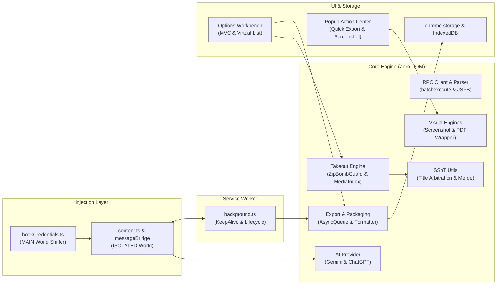

# 🌌 Gemini Exporter

<p align="left">
  <b>English</b> | <a href="./README_zh.md">简体中文</a>
</p>

<p align="left">
  <a href="https://chromewebstore.google.com/detail/gemini-exporter/ldpbiafkgjlaooeplkiooljccpalpkgf?utm_source=github&utm_medium=readme_en&utm_campaign=github_repo" target="_blank">
    
  </a>
  
  
</p>

> **The easiest, privacy-first way to export and archive your Google Gemini conversations.**  
> Batch export your chat history into clean Markdown, JSON, long screenshots, single-page PDFs, or a complete ZIP archive with images and attachments. Seamlessly migrate your chats into **Obsidian**, **Notion**, **Logseq**, or your local knowledge base.

---

## ✨ Why Gemini Exporter?

- 🔒 **100% Private & Local**: Runs completely inside your browser sandbox. Your conversations, credentials, and cookies are **never sent to any external server**.
- ⚡ **Zero Setup Required**: No API keys, no complicated tokens, no passwords. Just use Google Gemini as you normally do.
- 💾 **Real-Time Live Auto-Save (New in v1.6.0)**:
  - Automatically saves newly completed chat turns directly to your selected local folder via the native FileSystem Access API or local IndexedDB.
  - Zero lag, zero clicks required — chat on Gemini, and your local notes are instantly up to date.
  - Floating unobtrusive sync badge in the bottom-right corner displays real-time saving status.
- 📸 **Long Scrolling Screenshot & Single-Page PDF (New in v1.6.0)**:
  - Generate pixel-perfect full conversation long screenshots (`.png`) with intelligent frame-overlap elimination.
  - Export ultra-crisp, printable single-page PDFs (`.pdf`) powered by an internal zero-dependency native PDF 1.4 binary engine.
- 📝 **Beautiful Markdown Output**:
  - Full syntax highlighting for programming code blocks.
  - Formatted LaTeX mathematical formulas and equations.
  - Collapsible thinking / reasoning processes (`<details>`).
  - Web source citations and reference links preserved.
- 🖼️ **Complete Media & Attachment Backups**:
  - Automatically saves user-uploaded files (PDFs, docs, images).
  - Downloads AI-generated high-resolution images (Imagen).
  - Preserves Deep Research reports and documents.
  - Images and attachments are neatly placed in an `assets/` folder with relative Markdown links.
- 📊 **Visual Batch Workbench**:
  - Intuitive dark-mode dashboard to search, filter, and manage all your conversations.
  - Filter chats by status: *All*, *Unexported*, *Needs Re-export*, or *Exported*.
  - Full **Bilingual UI (English / 简体中文)** with a 1-click switcher.
  - Interactive 5-step **Onboarding Tour** with dynamic element highlighting.
- 🔄 **Smart Incremental Backup**:
  - Only export what is new! When an older chat receives new replies, it is automatically flagged so you can back it up in seconds without re-exporting everything.
- 📥 **Google Takeout Support**:
  - Easily import your official Google Takeout ZIP archive to recover older historical chats that Google's web sidebar no longer displays (bypassing Google's ~600 chat sidebar limitation).
- 👥 **Multi-Account Friendly**:
  - Seamlessly switch between different Google accounts in the Workbench with isolated storage for each (`u0`, `u1`, etc.).
- 🌐 **Extensible AI Provider Architecture**:
  - Built on a decoupled provider-neutral foundation (`AIProvider`), paving the way for multi-platform AI conversation management.

---

## 🏛️ Modular System Architecture Overview

Gemini Exporter is engineered using a robust 4-tier Chrome Manifest V3 modular architecture. Core logic is completely decoupled from browser DOM, allowing it to run identically in Node.js, Web Workers, and extension pages.



> 📖 For in-depth architectural diagrams, full AST logical mapping tables, and core data flow sequence diagrams, see the **[Architecture & Engineering Specification](./docs/architecture.md)**.

---

## 📥 Installation

### Method 1: Chrome Web Store (Recommended)

Install directly from the official Chrome Web Store with one click:

👉 **[Get Gemini Exporter on Chrome Web Store](https://chromewebstore.google.com/detail/gemini-exporter/ldpbiafkgjlaooeplkiooljccpalpkgf?utm_source=github&utm_medium=readme_en&utm_campaign=github_repo)**

*(Compatible with Google Chrome, Microsoft Edge, Brave, Arc, Vivaldi, and other Chromium browsers.)*

### Method 2: Install from Source Code (Developer / Manual)

1. Download or clone this repository:
   ```bash
   git clone https://github.com/OTLFrostA/gemini-exporter.git
   ```
2. Build the production bundles:
   ```bash
   npm install
   node build.js
   ```
3. In your browser, navigate to the Extensions page:
   - **Chrome**: `chrome://extensions/`
   - **Edge**: `edge://extensions/`
4. Turn on **Developer mode** (toggle in the top-right corner).
5. Click **Load unpacked** (top-left) and select the project folder.

---

## 🚀 How to Use

### 1. Quick Single-Chat Actions (Popup)
1. Open any conversation on [Google Gemini](https://gemini.google.com).
2. Click the **Gemini Exporter** icon in your browser toolbar.
3. Choose your desired action:
   - **Markdown / JSON**: Click **"Export Current Page"** or **"Copy Markdown"**.
   - **Long Screenshot**: Click **"Capture Long Screenshot"** to auto-scroll, stitch, and download a complete `.png`.
   - **Single-Page PDF**: Click **"Export Single-Page PDF"** for an instant high-res `.pdf` file.

### 2. Batch Export All Chats (Workbench)
1. Click the extension icon and select **"Go to Workbench"** (or right-click the icon and choose "Options").
2. Follow the 5-step **Onboarding Tour** on your first visit.
3. Click **"Sync Latest"** (for quick incremental sync) or **"Deep Scan"** (to fetch full cloud history).
4. Select the conversations you want to export (or click *Select All* / *Unexported Only*).
5. Choose your export format and click **"Export Selected → ZIP"** (or export directly into a local folder).

### 3. Real-Time Live Auto-Save to Local Folder
1. In the Workbench, navigate to **Settings** and enable **"Auto-Save to Local Folder"**.
2. Click **"Select Folder"** to grant access to your notes vault (e.g., Obsidian or a local folder).
3. Chat on Google Gemini as usual. Every time Gemini finishes generating a reply, the extension will automatically format and update the Markdown note and images in your local folder!

### 4. Archive Years of History via Google Takeout
If you have thousands of chats dating back years, Google's web interface limits sidebar scrolling to around ~600 chats. You can archive your complete history using Google Takeout:
1. Open **[Google Takeout (Gemini Pre-selected)](https://takeout.google.com/settings/takeout/custom/gemini)**, click "Next step", and download your archive ZIP.
2. In the Gemini Exporter Workbench, drag and drop the Takeout ZIP into the **Google Takeout Import** box.
3. The extension will automatically index and merge your historical chats and media offline!

---

## 💡 Using with Obsidian, Notion & Knowledge Bases

- **Obsidian**: Unzip the exported archive directly into your Obsidian Vault folder, or set Live Auto-Save directly to your Vault root. All Markdown notes and `assets/` images render instantly with working relative links.
- **Notion**: Drag and drop the exported Markdown files into Notion to import them as native workspace pages.
- **Logseq / Local Folders**: Use the **"Export to Local Folder"** option in the Workbench to write directly to your local notes directory via the FileSystem API.

---

## 🧪 Three-Tier Testing Architecture

Gemini Exporter maintains rigorous quality gates through a 3-tier testing architecture:

- **Tier 1: CI Fast & Headless Gate (`npm test`)**:
  - TypeScript strict type checking (`tsc --noEmit`).
  - 84 unit test suites running in Node.js via `python3 tests/run_tests.py`.
  - Single-pass `esbuild` production bundling verification (`node build.js`).
  - 14 test specs / 35 headless Playwright E2E browser tests (`playwright test`).
  - *Daily development*: `npm run test:changed` runs incremental dependency-impact tests in ~5–15s.
- **Tier 2: Live Chrome Debug Staging (`npm run test:live:pool`)**:
  - Connects to real Chrome on port 9222 with real account interactions.
  - Employs a dynamic 20-scenario multimodal test pool (`scripts/test_scenario_pool.json`).
  - Enforces physical ZIP download and bit-level content & image assertions (`export_spec_asserter.py`).
- **Tier 3: Pure Visual Agent & Autonomous QA (`npm run test:visual:review`)**:
  - Autonomous exploration using pure screenshot perception (zero DOM leakage) and hardware-level mouse/keyboard actions.
  - Multi-modal visual auditing powered by Gemini Vision with structured scorecards and HTML gallery reports.

---

## ❓ Frequently Asked Questions (FAQ)

<details>
<summary><b>Is my data safe? Does this extension upload my chats anywhere?</b></summary>
Yes, your data is 100% safe. Gemini Exporter is fully open-source and operates strictly client-side inside your browser sandbox. It does not possess any backend server, does not include any analytics or tracking scripts, and never collects or transmits your personal conversations or account credentials.
</details>

<details>
<summary><b>Do I need a Gemini API key or paid subscription?</b></summary>
No! You do not need an API key or a paid Gemini Advanced plan. It works directly with your standard browser session across both free and Advanced accounts.
</details>

<details>
<summary><b>Why does the web sidebar stop scrolling around 600 chats?</b></summary>
Google Gemini's web interface enforces a server-side limitation on how far back the sidebar can paginate. This affects the official Gemini web page itself. If you need conversations beyond this threshold, use our built-in <b>Google Takeout Import</b> feature to restore and export your entire history.
</details>

<details>
<summary><b>How does Live Auto-Save work without an open Workbench?</b></summary>
Live Auto-Save is powered by an in-page stream observer and Chrome's FileSystem Access API directory handle persisted securely in local IndexedDB. When a generation completes, the background handler writes directly to the authorized folder without needing the Options page open.
</details>

---

## 🔒 Privacy & Open Source

- **Privacy Policy**: Read our detailed [Privacy Policy](./docs/PRIVACY_POLICY.md).
- **License**: Released under the **[MIT License](./LICENSE)**.
- **Architecture & Developer Guide**: See [docs/architecture.md](./docs/architecture.md) and [src/README.md](./src/README.md).
- **Testing Guide**: See [tests/README.md](./tests/README.md).

---

## ⚠️ Disclaimer

- **Gemini Exporter** is an independent, open-source personal backup tool. It is **not affiliated with, sponsored by, or endorsed by Google LLC or Google Gemini**.
- "Google" and "Gemini" are registered trademarks of Google LLC.
