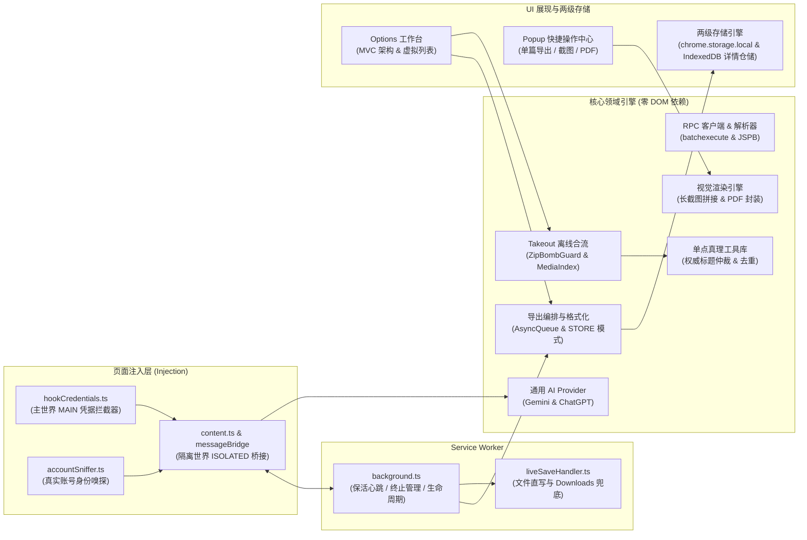

# 🌌 Gemini Exporter

<p align="left">
  <a href="./README.md">English</a> | <b>简体中文</b>
</p>

<p align="left">
  <a href="https://chromewebstore.google.com/detail/gemini-exporter/ldpbiafkgjlaooeplkiooljccpalpkgf?utm_source=github&utm_medium=readme_zh&utm_campaign=github_repo" target="_blank">
    
  </a>
  
  
</p>

> **简单、隐私安全、完全开源的 Google Gemini 对话批量导出与备份工具。**  
> 一键将你的全部 Gemini 历史对话导出为精美的 Markdown、JSON、高清超长长截图、单页矢量 PDF 或包含完整图片附件的 ZIP 压缩包，无缝导入 **Obsidian**、**Notion**、**Logseq** 等本地个人知识库。

---

## ✨ 为什么选择 Gemini Exporter？

- 🔒 **100% 本地运行与隐私零泄露**：
  - 完全在浏览器本地沙箱内处理数据，**绝不上报任何账号凭据、Cookie 或对话内容至外部服务器**。
- ⚡ **零配置开箱即用**：
  - 无需申请繁琐的 API Key，无需配置 Token 或输入密码。只要在浏览器中正常使用 Google Gemini 即可。
- 💾 **实时无感自动保存 (v1.6.0 重磅特性)**：
  - 支持通过浏览器原生 FileSystem Access API 或本地 IndexedDB，在对话生成结束时**自动将最新轮次写入本地指定磁盘文件夹**。
  - 无需手动点击、零感知延迟：在网页端正常聊 Gemini，本地笔记文件夹内的 Markdown 与配图即刻同步更新！
  - 网页右下角配备无侵入式浮动徽章，实时反馈“保存中...”与“已同步”状态，目录异常时优雅提示。
  - **无头环境写盘降权零损回退**：浏览器重启后，若后台 Service Worker 因 Chromium 无头环境限制无法弹出目录授权窗，自动无感激活 `chrome.downloads`（落盘至 `Downloads/gemini_export/`）保障数据 100% 落地，并在 UI 提供一键手势恢复物理直写。
- 📸 **全对话超长长截图与单页 PDF 打印 (v1.6.0 重磅特性)**：
  - 一键自动逐屏滚动、精准消除视口重叠、缝合生成高分辨率全景长截图 (`.png`)。
  - 内置纯二进制无依赖的 PDF 1.4 生成引擎，秒级输出可矢量缩放打印的单页无缝 `.pdf` 文件。
- 📝 **精美的 Markdown 排版**：
  - 代码块全语法高亮。
  - 完美渲染 LaTeX 数学公式与方程。
  - 折叠显示 AI 深度思考推理过程（`<details>` 标签）。
  - 完整保留网络引用来源与标注链接。
- 🖼️ **完整的图片与附件归档**：
  - 自动下载对话中你上传的文件与图片（PDF、文档等）。
  - 自动保存 AI 生成的高清画作（Imagen）。
  - 完整备份深度研究（Deep Research）独立长篇报告。
  - 所有图片与资源自动存放于 `assets/` 文件夹，并在 Markdown 中使用相对链接规范引用。
  - **STORE 模式零压缩内存保护**：高清二进制媒体附件在打包进入 ZIP 时采用 STORE 原样存储模式，彻底规避 200MB+ 批量多模态导出时因多重 Deflate 压缩导致的浏览器标签页内存溢出崩溃（OOM）。
- 🗄️ **两级存储架构与配额安全隔离**：
  - 突破 Chrome `chrome.storage.local` 的 10MB 配额硬限制：顶层仅保存轻量索引（严格控制在安全水位内），全量对话多轮次与消息正文实体安全沉淀至 IndexedDB（`conversationDetailStore.ts`）。
  - 支持轻松承载成千上万条深度对话，彻底杜绝数据截断或存储满载崩溃。
- 📊 **可视化批量管理工作台 (Workbench)**：
  - 沉浸式深色模式面板，轻松浏览、搜索与管理数百条历史对话。
  - 支持按状态智能筛选：*全部*、*未导出*、*有新回复待更新* 或 *已导出*。
  - 完整支持 **中英双语界面**，右上角一键切换。
  - 动态元素几何定位的 5 步沉浸式 **新手交互向导**。
- 🔄 **智能增量备份**：
  - 只备份新内容！当旧会话收到新的提问或回复时，工作台会自动将其标记为“待更新”，一键即可增量导出，省时省力。
- 📥 **支持 Google Takeout 历史归档导入**：
  - 轻松导入官方 Google Takeout 导出的历史数据压缩包，帮你找回因 Gemini 网页侧边栏滚动上限（约 600 条）而无法直接拉取的更早历史对话。
- 👥 **真实多账号身份隔离与凭据零借调**：
  - 基于 `accountSniffer.ts` 智能嗅探当前会话的真实 Google 邮箱、显示名称与 Gaia ID。
  - 工作台下拉菜单直观展示真实账户邮箱，告别冰冷生涩的抽象槽位 ID。
  - 各账号间凭据命名空间与会话实体物理隔离，多标签页通信严格绑定 Slot，绝不跨账号借调 Token 或错发 RPC。
- 🌐 **通用 AI Provider 架构**：
  - 底层基于模型无关的 `AIProvider` 规范构建，预留多模型平台生态接入能力。

---

## 🏛️ 模块化系统架构概览

Gemini Exporter 严格遵循 Chrome Extension MV3 分层解耦设计，核心业务领域与解析逻辑实现 **零 DOM 依赖**，可在 Node.js 测试、Service Worker 与扩展页面中无缝复用。



> 📖 如需查阅完整高清系统模块图、全项目 AST 逻辑映射表与 6 大核心数据流全链路时序图，请访问 **[系统架构与工程规范指南](./docs/architecture.md)**。

---

## 📥 安装指南

### 方式一：Chrome 网上应用店一键安装（官方推荐）

通过 Chrome 官方商店一键获取最新正式版：

👉 **[前往 Chrome 应用商店安装 Gemini Exporter](https://chromewebstore.google.com/detail/gemini-exporter/ldpbiafkgjlaooeplkiooljccpalpkgf?utm_source=github&utm_medium=readme_zh&utm_campaign=github_repo)**

*(支持 Google Chrome、Microsoft Edge、Brave、Arc、Vivaldi 等所有基于 Chromium 的现代浏览器。)*

### 方式二：通过源码 / 开发者模式安装

1. 下载或克隆本仓库到本地：
   ```bash
   git clone https://github.com/OTLFrostA/gemini-exporter.git
   ```
2. 编译生产打包文件：
   ```bash
   npm install
   node build.js
   ```
3. 在浏览器中打开扩展管理页面：
   - **Chrome**: 在地址栏访问 `chrome://extensions/`
   - **Edge**: 在地址栏访问 `edge://extensions/`
4. 打开页面右上角的 **“开发者模式” (Developer mode)** 开关。
5. 点击左上角的 **“加载已解压的扩展程序” (Load unpacked)**，选择本项目文件夹即可完成安装。

---

## 🚀 使用指南

### 1. 快速导出当前单篇对话 (Popup)
1. 在浏览器中打开 [Google Gemini](https://gemini.google.com) 的任意对话。
2. 点击浏览器右上角扩展栏的 **Gemini Exporter** 图标。
3. 选择所需操作：
   - **Markdown / JSON**：点击 **“只导当前页”** 或 **“一键复制 Markdown”**；
   - **长截图**：点击 **“生成长截图”**，全自动平滑滚动并下载高清 `.png`；
   - **单页 PDF**：点击 **“导出单页 PDF”**，瞬间生成适合打印归档的 `.pdf`。

### 2. 批量管理与导出全部对话 (Workbench)
1. 点击插件图标中的 **“去工作台选 批量导出”**（或右键插件图标选择“选项”）。
2. 初次使用可跟随 5 步 **新手引导教程** 熟悉核心功能。
3. 点击 **“同步最新会话”**（快速增量同步）或 **“全量拉取历史”**（扫描所有云端历史）。
4. 勾选想要导出的对话（支持“全选”或“只选未导出”）。
5. 选择导出格式，点击 **“导出选中 → ZIP”** 打包下载（也可选择直接写入本地文件夹）。

### 3. 配置实时无感自动保存到本地文件夹
1. 在工作台中进入 **“设置”**，开启 **“自动保存到本地文件夹”** 开关；
2. 点击 **“选择文件夹”**，授权选择你的个人笔记根目录（如 Obsidian Vault 或本地文档文件夹）；
3. 随后在 Google Gemini 正常对话，每当 AI 回复生成完毕，插件会自动在后台静默将最新轮次写入该文件夹，配图同步落地！

### 4. 使用 Google Takeout 归档数年远古历史
如果你的账号有上千条历史对话，Gemini 网页端侧边栏受官方技术限制通常只支持滚动浏览约 600 条记录。如需完整备份更早的远古会话：
1. 点击打开 **[Google Takeout (已预选 Gemini)](https://takeout.google.com/settings/takeout/custom/gemini)**，直接点击“下一步”并创建导出，下载生成的 Takeout ZIP 压缩包。
2. 在 Gemini Exporter 工作台的 **“Google Takeout 导入”** 区域拖入该 ZIP 文件。
3. 扩展程序会在本地离线解压、清洗 HTML 并自动合流历史会话与媒体附件！

---

## 💡 与 Obsidian、Notion 等知识库联动

- **Obsidian**: 直接将导出的 ZIP 压缩包解压到你的 Obsidian 仓库（Vault）文件夹中，或者将“实时自动保存”的目标直接设为 Vault 根目录。所有 Markdown 笔记与 `assets/` 中的图片附件将瞬间建立关联并支持双向链接。
- **Notion**: 将导出的 Markdown 文件直接拖入 Notion 页面，即可自动转为原生的 Notion 页面与排版块。
- **Logseq / 本地文件夹**: 在工作台中开启 **“直接保存到本地文件夹”**，利用现代文件系统权限直接将文件写入你的本地磁盘。

---

## 🧪 严格的三层测试质量保证体系

项目构建了行业领先的 3 层测试防线，兼顾 CI 极速验证与真实环境闭环：

- **第一层：CI 自动化极速门禁 (`npm test`)**：
  - TypeScript 严格类型检查 (`tsc --noEmit`)；
  - 84 个核心单元测试套件 (`python3 tests/run_tests.py`)；
  - esbuild 5 大 Bundle 纯打包构建检查 (`node build.js`)；
  - 14 个 Spec 文件 / 35 个无头 Playwright 端到端浏览器测试 (`playwright test`)；
  - *日常开发推荐*：`npm run test:changed` 秒级（5~15s）运行改动影响传递测试。
- **第二层：真实 Chrome 全流程实跑测试 (`npm run test:live:pool`)**：
  - 依托 9222 调试端口与真实 Google 账号交互；
  - 维持 20 题多模态高价值场景动态池（覆盖 Imagen 生图、LaTeX、代码块、长文本报告）；
  - 严格通过物理解压 ZIP 逐字断言与 4 大黄金分类附件规范检验。
- **第三层：纯视觉 AI 盲测与自主质检 (`npm run test:visual:review`)**：
  - 采用纯截屏感知（零 DOM 泄露）与硬件级物理鼠标/键盘事件自主驱动；
  - 驱动 Gemini Vision 多模态模型对全链路截图画廊出具深度质量审查报告。

---

## ❓ 常见问题 (FAQ)

<details>
<summary><b>我的数据安全吗？插件会上传我的对话吗？</b></summary>
绝对安全。Gemini Exporter 是一款完全开源的本地工具，没有任何后端服务器，也不包含任何统计、分析或跟踪代码。所有的解析、打包与导出都在你的电脑浏览器本地完成，绝不会收集或上传任何个人数据。
</details>

<details>
<summary><b>我需要购买 Gemini Advanced 或申请 API Key 吗？</b></summary>
不需要。无论是免费版 Gemini 用户还是 Advanced/Pro 付费用户均可直接使用，也无需额外购买或配置任何 API Key。
</details>

<details>
<summary><b>为什么 Gemini 网页有时滚动到约 600 条就无法继续向下滚了？</b></summary>
这是 Google Gemini 网页端自身对历史侧边栏列表的分页限制（即使不使用插件，手动在官方网页一直往下滚也会遇到）。如果你需要归档超过此数量的历史，推荐使用本项目内置的 <b>Google Takeout 导入</b> 功能，完美找回并导出全部早期记录。
</details>

<details>
<summary><b>实时自动保存在不打开工作台时能工作吗？</b></summary>
可以。实时自动保存由 Gemini 网页内的流式监视器感知，并通过持久化在 IndexedDB 中的 FileSystem 目录句柄由 Background 线程直接调度写入，无需常驻打开 Options 工作台。若浏览器重启导致目录句柄降权且处于无头环境，后台会自动降级保存至 <code>Downloads/gemini_export/</code>，确保轮次数据永不丢失，并在工作台中提示 1 键手势重授权。
</details>

<details>
<summary><b>插件能承受上千条长对话吗？会不会超出浏览器存储配额？</b></summary>
完全可以！得益于我们的<b>两级存储架构</b>，快速索引保存在 <code>chrome.storage.local</code> 中（严格压制在 10MB 配额安全水位以内），而完整的对话轮次与重消息体则下沉持久化至本地 IndexedDB（<code>conversationDetailStore</code>）。你可以放心保存成千上万条对话而无需担心存储满载或数据截断。
</details>

<details>
<summary><b>多账号切换是如何工作的？</b></summary>
Gemini Exporter 会基于 <code>accountSniffer.ts</code> 自动嗅探当前激活标签页的真实 Google 账户邮箱与 Gaia ID。每个账号被分配完全独立的物理隔离存储空间与凭据 Slot。你可以在工作台右上角按邮箱直接切换，完全杜绝账号间凭据借调与命令错发。
</details>

---

## 🔒 隐私与开源协议

- **隐私政策**: 欢迎查阅详细的 [隐私政策 (Privacy Policy)](./docs/PRIVACY_POLICY.md)。
- **开源协议**: 本项目基于 **[MIT License](./LICENSE)** 授权开源。
- **架构与开发者指南**: 详见 [docs/architecture.md](./docs/architecture.md) 与 [src/README.md](./src/README.md)。
- **测试指南**: 详见 [tests/README.md](./tests/README.md)。

---

## ⚠️ 免责声明

- **Gemini Exporter** 是一款独立的个人数据备份开源工具，**与 Google LLC 或 Google Gemini 不存在任何隶属、赞助或背书关系**。
- "Google" 与 "Gemini" 为 Google LLC 的注册商标。
