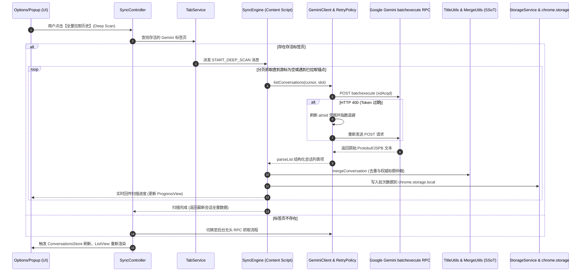
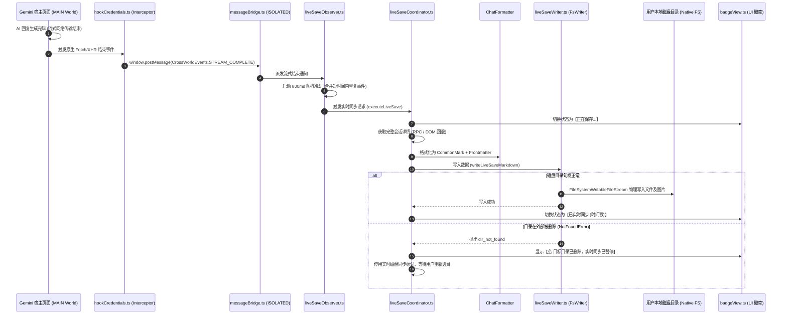
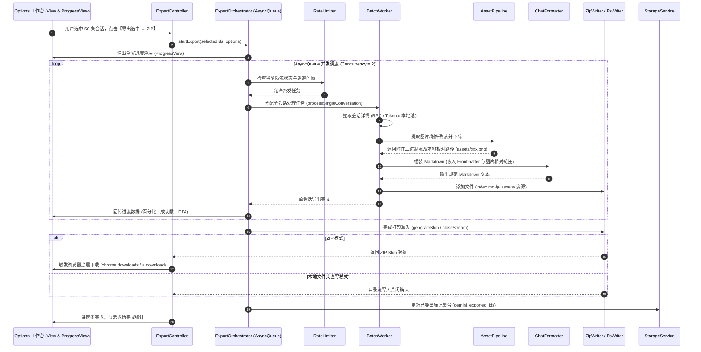
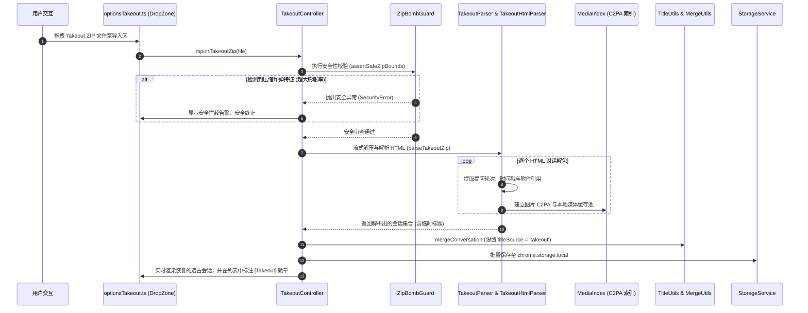
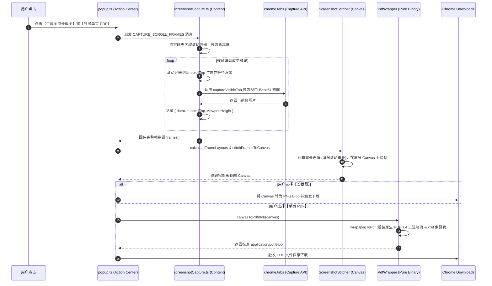
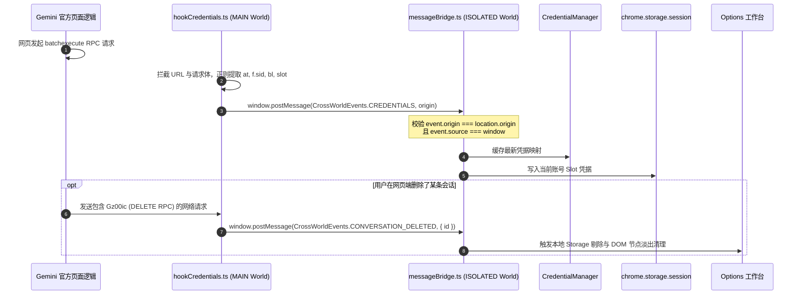

# 🛡️ Gemini Exporter — System Architecture & Engineering Specification

本文档提供 **Gemini Exporter**（v1.6.0+）的深度工程架构全景说明，涵盖完整的 Chrome MV3 模块化架构图、代码库 AST 逻辑分布与架构映射矩阵、核心业务数据流全链路时序图（含数据源、数据汇与容灾处理逻辑）、安全设计不变量与三层测试体系规范。

---

## 目录 (Table of Contents)

1. [一、模块化系统架构全景 (Modular Subsystem Architecture)](#一模块化系统架构全景-modular-subsystem-architecture)
2. [二、AST 逻辑分布与架构映射矩阵 (AST Logical Distribution & Architecture Mapping)](#二ast-逻辑分布与架构映射矩阵-ast-logical-distribution--architecture-mapping)
3. [三、核心数据流全链路时序图与数据源汇规范 (Core Data Flows, Sources & Sinks)](#三核心数据流全链路时序图与数据源汇规范-core-data-flows-sources--sinks)
   - [3.1 会话增量同步与全量拉取数据流 (Incremental & Deep Scan Sync Flow)](#31-会话增量同步与全量拉取数据流-incremental--deep-scan-sync-flow)
   - [3.2 实时无感自动保存数据流 (Real-Time Live Auto-Save Flow)](#32-实时无感自动保存数据流-real-time-live-auto-save-flow)
   - [3.3 批量并发导出与流式打包数据流 (Batch Export Pipeline Flow)](#33-批量并发导出与流式打包数据流-batch-export-pipeline-flow)
   - [3.4 Google Takeout 历史脱机合流数据流 (Takeout Offline Ingestion Flow)](#34-google-takeout-历史脱机合流数据流-takeout-offline-ingestion-flow)
   - [3.5 Popup 快捷操作、长截图拼接与单页 PDF 导出数据流 (Popup Quick Capture, Screenshot & PDF Flow)](#35-popup-快捷操作长截图拼接与单页-pdf-导出数据流-popup-quick-capture-screenshot--pdf-flow)
   - [3.6 网络凭据嗅探与跨隔离区握手数据流 (Credential Sniffing & Cross-World Bridge Flow)](#36-网络凭据嗅探与跨隔离区握手数据流-credential-sniffing--cross-world-bridge-flow)
4. [四、核心工程设计不变量 (Key Engineering Invariants)](#四核心工程设计不变量-key-engineering-invariants)
5. [五、三层测试体系架构 (Three-Tier Testing Architecture)](#五三层测试体系架构-three-tier-testing-architecture)

---

## 一、模块化系统架构全景 (Modular Subsystem Architecture)

Gemini Exporter 严格遵循 Chrome Extension Manifest V3 规范，将系统解耦为 **主世界网络嗅探层**、**隔离世界内容脚本层**、**后台服务工作线程 (Service Worker)**、**跨平台通用 Provider 与解析核心**、**领域导出/打包引擎**、**响应式持久化层** 以及 **用户界面展示层**。

```mermaid
graph TD
    subgraph BrowserRuntime ["Chrome 运行时宿主环境 (Browser Runtime Environment)"]
        subgraph WebPageMainWorld ["Gemini 网页端宿主环境 (MAIN World)"]
            MAIN_Hook["hookCredentials.ts<br/>(网络/XHR/Fetch 拦截器 & 凭据/事件嗅探)"]
        end

        subgraph ContentScriptIsolated ["扩展隔离区内容脚本 (ISOLATED World)"]
            CS_Entry["content.ts<br/>(内容脚本总协调入口)"]
            CS_Bridge["messageBridge.ts<br/>(跨世界事件桥接器)"]
            CS_LiveObs["liveSaveObserver.ts<br/>(流式输出/DOM 变更监视器)"]
            CS_LiveCoord["liveSaveCoordinator.ts<br/>(实时无感保存调度器)"]
            CS_SyncEng["syncEngine.ts<br/>(分页扫描/增量同步引擎)"]
            CS_DomScraper["domScraper.ts<br/>(网页 DOM 回退解析抓取器)"]
            CS_Badge["badgeView.ts<br/>(右下角悬浮状态提示徽章)"]
            CS_Shot["screenshotCapture.ts<br/>(滚动视口分帧捕获器)"]
        end

        subgraph BackgroundSW ["后台服务工作线程 (Service Worker)"]
            BG_Entry["background.ts<br/>(中央消息路由器 & 生命周期管理)"]
            BG_KeepAlive["keepAlive.ts<br/>(长任务心跳保活机制)"]
            BG_Abort["abortManager.ts<br/>(多账号 Slot 中断状态管理器)"]
            BG_Batch["batchFetcher.ts<br/>(后台并发批处理请求器)"]
            BG_LiveHandler["liveSaveHandler.ts<br/>(后台原生目录句柄写入代理)"]
            BG_TabAction["tabAction.ts<br/>(图标动态着色与激活状态感知)"]
        end

        subgraph ExtensionPages ["扩展交互前端页面 (Extension Pages: Options & Popup)"]
            subgraph PopupView ["快捷操作面板 (Popup Action Center)"]
                POP_Main["popup.ts / popup.html<br/>(一键导出/长截图/PDF/复制)"]
            end

            subgraph OptionsWorkbench ["批量管理工作台 (Options Workbench)"]
                OPT_Main["options.ts / options.html<br/>(工作台总入口 & 协调器)"]
                OPT_Modules["optionsInit / optionsExport / optionsSync<br/>optionsTakeout / optionsSettings"]
                OPT_Store["conversationsStore.ts<br/>(响应式状态机 & 筛选排序)"]
                OPT_Views["listView / logView / accountView<br/>dialogView / progressView"]
                OPT_Controllers["exportController / syncController<br/>takeoutController / dirHandleController"]
                OPT_Tour["tourGuide.ts / tourSteps.ts<br/>(5步沉浸式新手引导与高亮遮罩)"]
            end
        end
    end

    subgraph CoreEngine ["核心领域逻辑与引擎层 (Core Domain Logic & Engine - Zero DOM)"]
        subgraph ProviderLayer ["通用多模型 Provider 抽象层 (src/core/provider/)"]
            PROV_Registry["ProviderRegistry<br/>(多提供商动态注册表)"]
            PROV_Gemini["GeminiProvider<br/>(Gemini batchexecute 协议适配)"]
            PROV_ChatGPT["ChatGPTProvider<br/>(ChatGPT API/DOM 协议适配)"]
        end

        subgraph ApiParserLayer ["协议通信与反序列化层 (src/core/api/)"]
            API_Client["GeminiClient (facade)<br/>rpcClient / pagination / retryPolicy / credentialManager"]
            API_Parser["GeminiParser (facade)<br/>parseList / parseDetail / extractors / attachments"]
        end

        subgraph ExportEngines ["导出、转换与打包引擎 (src/core/engine/)"]
            ENG_Orchestrator["ExportOrchestrator<br/>(批量导出编排器 & AsyncQueue 队列)"]
            ENG_Worker["BatchWorker<br/>(单会话抓取与任务单元)"]
            ENG_Rate["RateLimiter<br/>(自适应指数退避与熔断器)"]
            ENG_Formatter["ChatFormatter<br/>(Markdown / JSON / OpenAI 转换器)"]
            ENG_Takeout["TakeoutEngine<br/>(Takeout ZIP 解析 / MediaIndex / ZipBombGuard)"]
            ENG_LiveWriter["liveSaveWriter.ts<br/>(实时 Markdown / JSON 文件流写入器)"]
            ENG_Stitcher["screenshotStitcher.ts<br/>(长截图重叠消除与画布拼接)"]
            ENG_PDF["pdfWrapper.ts<br/>(零依赖单页 PDF 1.4 二进制封装器)"]
            ENG_Writers["Writers: zipWriter (JSZip) / fsWriter (FileSystem API)"]
        end

        subgraph CoreUtils ["工具库与单点真理 (src/core/utils/)"]
            UT_SSoT["utils.ts / titleUtils.ts / mergeUtils.ts<br/>(权威标题仲裁、去重、时间戳排序)"]
            UT_Path["pathUtils.ts / chipUtils.ts / progressUtils.ts"]
            UT_I18n["i18n.ts (locales/zh.ts, locales/en.ts)"]
        end

        subgraph StorageLayer ["存储抽象与持久化层 (src/core/storage/)"]
            ST_Service["StorageService<br/>(chrome.storage.local 多账号 Slot 隔离存储)"]
            ST_Live["LiveStorageManager<br/>(IndexedDB 实时会话镜像库)"]
            ST_IDB["idbHandleStore.ts<br/>(FileSystemDirectoryHandle 跨会话持久化)"]
            ST_Session["SessionStore.ts<br/>(内存/chrome.storage.session 缓存)"]
        end
    end

    %% 跨世界通信线
    MAIN_Hook -- "window.postMessage (CrossWorldEvents)" --> CS_Bridge
    CS_Bridge --> CS_LiveObs
    CS_LiveObs --> CS_LiveCoord
    CS_Bridge --> CS_SyncEng

    %% 内容脚本与后台通信
    CS_LiveCoord -- "runtime.sendMessage (handleLiveSaveViaHandle)" --> BG_LiveHandler
    CS_SyncEng -- "runtime.sendMessage (fetchBatch / keepAlive)" --> BG_SW
    POP_Main -- "tabs.sendMessage / runtime.sendMessage" --> CS_Shot
    OPT_Controllers -- "runtime.sendMessage" --> BG_SW

    %% 模块连接到核心逻辑
    CS_SyncEng --> PROV_Gemini
    CS_LiveCoord --> ENG_LiveWriter
    CS_LiveCoord --> ST_Live
    BG_LiveHandler --> ST_IDB
    BG_LiveHandler --> ENG_LiveWriter

    OPT_Controllers --> ENG_Orchestrator
    OPT_Controllers --> ENG_Takeout
    ENG_Orchestrator --> ENG_Worker
    ENG_Orchestrator --> ENG_Rate
    ENG_Worker --> PROV_Gemini
    ENG_Worker --> ENG_Formatter
    ENG_Worker --> ENG_Writers
    POP_Main --> ENG_Stitcher
    POP_Main --> ENG_PDF
    POP_Main --> ENG_Formatter

    %% 存储与工具支持
    ENG_Orchestrator --> ST_Service
    ENG_Takeout --> UT_SSoT
    ENG_Orchestrator --> UT_SSoT
    CS_SyncEng --> UT_SSoT
```

---

## 二、AST 逻辑分布与架构映射矩阵 (AST Logical Distribution & Architecture Mapping)

下表呈现整个代码库 `src/` 目录下全部 62 个核心源码文件的抽象语法树 (AST) 逻辑职责、核心导出实体、数据依赖以及在架构图中的映射定位：

| 物理源码路径 (File Path) | 架构分层 / 子系统 | 核心 AST 导出实体 (Classes / Functions / Interfaces) | 模块职责与设计不变量 (Role & Invariants) | 上游调用源 (Inflow) | 下游承接汇 (Outflow) | 架构图映射节点 |
|---|---|---|---|---|---|---|
| `src/background/background.ts` | Background SW | `background.ts` (Entrypoint), 消息监听器 | Service Worker 入口，负责中央消息路由、初始化生命周期、保持心跳及多账号中断状态。 | Chrome 运行时、Content、UI | `abortManager`, `keepAlive`, `liveSaveHandler`, `tabAction` | `BG_Entry` |
| `src/background/lifecycle.ts` | Background SW | `initSessionAccessLevel`, `initLifecycleListeners`, `initUninstallUrl` | 处理插件安装打开选项页、配置卸载反馈地址、设置 session 存储访问级别。 | `background.ts` | Chrome APIs (`runtime.onInstalled`, `storage.session`) | `BG_Entry` |
| `src/background/keepAlive.ts` | Background SW | `startKeepAlive`, `stopKeepAlive` | 在耗时较长的批量导出与全量扫描期间派发微型心跳，防止 MV3 Service Worker 意外挂起。 | `background.ts` | Chrome runtime 端口心跳 | `BG_KeepAlive` |
| `src/background/abortManager.ts` | Background SW | `isSlotAborted`, `setSlotAborted`, `restoreAbortFlags` | 维护多账号 Slot 级别的中断标记，并在 session storage 中跨唤醒持久化。 | `background.ts`, `syncController.ts` | `chrome.storage.session` | `BG_Abort` |
| `src/background/batchFetcher.ts` | Background SW | `fetchBatch`, `sendToGeminiTab`, `getGeminiTab` | 后台代理并发抓取 batchexecute 请求，跨标签页消息转发。 | `background.ts` | `chrome.tabs.sendMessage` | `BG_Batch` |
| `src/background/liveSaveHandler.ts` | Background SW | `handleLiveSaveViaHandle`, `markDirDeletedInConfig` | 接收 Content 脚本发来的实时保存数据，从 IndexedDB 取出目录句柄执行写入。 | `background.ts` (runtime.onMessage) | `idbHandleStore`, `liveSaveWriter` | `BG_LiveHandler` |
| `src/background/tabAction.ts` | Background SW | `updateTabActionState`, `initTabActionListeners` | 监视激活标签页 URL 是否为 Gemini 域名，动态切换彩色/灰色图标状态。 | `background.ts`, tabs 事件 | `chrome.action.setIcon` | `BG_TabAction` |
| `src/content/content.ts` | Content Script | `content.ts` (Entrypoint) | 隔离区主入口，统筹初始化 Observer、Bridge、SyncEngine、LiveSave 与徽章视图。 | Chrome Content Script 注入 | `cleanupRegistry`, `messageBridge`, `pageObserver`, `syncEngine` | `CS_Entry` |
| `src/content/hookCredentials.ts` | Content Script (MAIN) | `hookCredentials.ts` (IIFE) | 注入页面主世界，拦截原生 `fetch` 与 `XMLHttpRequest`，嗅探网络凭据、删除 RPC 与流式事件。 | 原生 Gemini 页面交互 | `window.postMessage` (锁定 origin) | `MAIN_Hook` |
| `src/content/messageBridge.ts` | Content Script | `MessageBridge`, `handleWindowMessage` | 监听主世界 `postMessage`，校验来源，解包凭据、流式事件、删除 RPC 并分发给内部引擎。 | `hookCredentials.ts` | `syncEngine`, `liveSaveCoordinator`, `liveSaveObserver` | `CS_Bridge` |
| `src/content/liveSaveObserver.ts` | Content Script | `LiveSaveObserver`, `init`, `cleanup` | 监听 Gemini 对话流式生成与 DOM 变更，在生成结束时触发冷却防抖并调用协调器。 | `messageBridge`, DOM MutationObserver | `liveSaveCoordinator` | `CS_LiveObs` |
| `src/content/liveSaveCoordinator.ts` | Content Script | `LiveSaveCoordinator`, `init`, `executeLiveSave` | 实时保存总调度：拉取会话完整轮次，排重并调用 FileSystem 句柄或向后台分发写入，刷新徽章。 | `liveSaveObserver` | `liveStorageManager`, `liveSaveWriter`, `badgeView`, `bg` | `CS_LiveCoord` |
| `src/content/syncEngine.ts` | Content Script | `SyncEngine`, `syncRecent`, `deepScanAll` | 负责前台对话列表抓取，协调增量同步与全量分页扫描，并将结果交由 SSoT 合并入库。 | `content.ts`, `syncController` | `geminiClient`, `storageService`, `utils` | `CS_SyncEng` |
| `src/content/domScraper.ts` | Content Script | `DomScraper`, `scrapeCurrentPage` | 当 RPC 不可用或离线时，直接从宿主页面 DOM 树结构化提取会话提问、回复、附件与元数据。 | `liveSaveCoordinator`, `popup.ts` | 规范化 `ConversationDetail` 实体 | `CS_DomScraper` |
| `src/content/badgeView.ts` | Content Script | `BadgeView`, `ensureBadge`, `updateBadge` | 在 Gemini 页面右下角渲染无侵入式浮动徽章，实时显示同步进度与保存状态。 | `content.ts`, `liveSaveCoordinator` | 宿主页面 DOM (`#geminiExportBadge`) | `CS_Badge` |
| `src/content/screenshotCapture.ts` | Content Script | `captureScrollFrames`, `getPageDimensions` | 自动滚动聊天容器并按视口步长连续截屏，捕获滚动帧元数据供拼接器使用。 | `popup.ts` (消息派发) | 帧位移与视口宽高数组 | `CS_Shot` |
| `src/content/assetFetcher.ts` | Content Script | `AssetFetcher`, `fetchAsBlob`, `inferImageExt` | 处理用户上传附件与 AI 生成图片的高清源 URL 解析与 Blob 二进制下载。 | `liveSaveCoordinator`, `domScraper` | ArrayBuffer / Blob 二进制流 | `CS_LiveCoord` |
| `src/content/bootstrap.ts` | Content Script | `ensureCreds`, `bootstrapToken` | 页面启动引导，提取页面内嵌的初始化配置与第一手 XSRF Token。 | `content.ts` | `credentialManager` | `CS_Entry` |
| `src/content/cleanupRegistry.ts` | Content Script | `registerCleanup`, `runCleanups` | 注册页面热重载或重新注入时的注销回调，防止监听器内存泄漏。 | Content 脚本各模块 | 事件监听器解绑 | `CS_Entry` |
| `src/content/contentContext.ts` | Content Script | `contentContext` (单例上下文) | 管理注入状态、开发模式标记、取消令牌与国际化语言环境。 | Content 脚本各模块 | 上下文状态只读/写入 | `CS_Entry` |
| `src/content/messageRouter.ts` | Content Script | `MessageRouter`, `init` | 隔离区内部消息分发器，处理来自 Options/Popup 的控制指令。 | `content.ts`, Extension Pages | `syncEngine`, `screenshotCapture` | `CS_Bridge` |
| `src/content/pageObserver.ts` | Content Script | `PageObserver`, `init`, `cleanup` | 观察 SPA URL 路径跳转（如切换会话）与侧边栏 DOM 挂载。 | `content.ts` | `syncEngine.touchActiveConversation` | `CS_Entry` |
| `src/core/provider/aiProvider.ts` | Core: Provider | `AIProvider`, `ProviderConversationItem`, `ProviderCapabilities` | 定义跨异构 AI 模型平台的通用接口契约规范。 | 所有 Provider 模块 | 上层引擎统一接口 | `PROV_Registry` |
| `src/core/provider/providerRegistry.ts` | Core: Provider | `ProviderRegistryClass`, `ProviderRegistry` (单例) | 全局 Provider 注册表，支持按平台 ID 或当前页面 URL 模式匹配提供商。 | 各 Provider 自动注册 | `liveSaveCoordinator`, `exportOrchestrator` | `PROV_Registry` |
| `src/core/provider/gemini/geminiProvider.ts` | Core: Provider | `GeminiProvider` (实现 `AIProvider`) | Gemini 平台适配器，封装 batchexecute RPC 调用与多账号 Slot 映射。 | `providerRegistry.ts` | `geminiClient`, `geminiParser` | `PROV_Gemini` |
| `src/core/provider/chatgpt/chatgptProvider.ts` | Core: Provider | `ChatGPTProvider` (实现 `AIProvider`) | ChatGPT 平台适配器，支持对话列表抓取与结构转换。 | `providerRegistry.ts` | ChatGPT DOM / API 适配 | `PROV_ChatGPT` |
| `src/core/api/geminiClient.ts` | Core: API | `GeminiAPIClient` (Facade) | 统一客户端入口，封装身份认证、分页抓取、指数退避重试与 AbortSignal 控制。 | `geminiProvider`, `syncEngine`, `exportWorker` | `client/*` 子模块 | `API_Client` |
| `src/core/api/geminiParser.ts` | Core: API | `GeminiResponseParserClass` (Facade) | 统一反序列化入口，解析 Protobuf/JSPB 复杂嵌套数组，提取轮次、思维链与附件。 | `geminiClient`, `messageBridge` | `parser/*` 子模块 | `API_Parser` |
| `src/core/api/client/credentialManager.ts` | Core: API Client | `resolveCred`, `getAtFromPage`, `detectSlot` | 统一管理 SNlM0e、at、sid 等鉴权凭据的获取、缓存与多账号槽位推断。 | `geminiClient.ts` | `credStorage.ts` | `API_Client` |
| `src/core/api/client/pagination.ts` | Core: API Client | `paginateList`, `fetchDetailWithRetry` | 封装 batchexecute 游标翻页机制与超时控制。 | `geminiClient.ts` | `rpcClient.ts` | `API_Client` |
| `src/core/api/client/retryPolicy.ts` | Core: API Client | `executeWithRetry`, `isTransientError` | 处理 HTTP 400（XSRF 过期刷新）、429（频率限制）的指数退避与重试策略。 | `geminiClient.ts` | 网络请求调用 | `API_Client` |
| `src/core/api/client/rpcClient.ts` | Core: API Client | `postBatchexecute`, `getApiUrl` | 构造 batchexecute 原始 POST 请求负载、组装 RPC 封包并处理响应转义。 | `geminiClient.ts` | `window.fetch` | `API_Client` |
| `src/core/api/parser/parseList.ts` | Core: API Parser | `parseList`, `extractListItemTimestamp` | 从 batchexecute 响应中提取会话列表项（ID、标题、修改时间）。 | `geminiParser.ts` | 原始数组 -> 会话摘要列表 | `API_Parser` |
| `src/core/api/parser/parseDetail.ts` | Core: API Parser | `parseDetail`, `detectTurnSchemaDrift` | 递归遍历多轮对话数组，提取提问/回复角色、时间戳并检测 Schema 漂移。 | `geminiParser.ts` | 原始数组 -> 轮次列表 (`ChatMessage[]`) | `API_Parser` |
| `src/core/api/parser/extractors.ts` | Core: API Parser | `extractCandidateText`, `extractThoughts`, `extractCitations` | 提取模型思考推理过程（Thought Blocks）、候选回答文本与网络引用链接。 | `parseDetail.ts` | 候选数据块 -> 纯文本与引用元数据 | `API_Parser` |
| `src/core/api/parser/attachments.ts` | Core: API Parser | `extractImages`, `extractUserFiles`, `extractDocumentsMeta` | 提取图片附件（含 Imagen 生成图与用户上传图）、文件与 Deep Research 报告。 | `parseDetail.ts` | 附件原始元数据 -> `Attachment[]` | `API_Parser` |
| `src/core/engine/exportEngine.ts` | Core: Engine | `ExportEngine` (Facade 别名 `ExportOrchestrator`) | 导出引擎统一命名空间门面，对上游保持稳定契约。 | UI 控制器 | `exportOrchestrator.ts` | `ENG_Orchestrator` |
| `src/core/engine/export/exportOrchestrator.ts` | Core: Engine | `ExportOrchestrator`, `AsyncQueue` | 编排批量导出作业，维护基于并发上限的异步任务队列，驱动进度通知与异常恢复。 | `exportController.ts` | `batchWorker`, `rateLimiter`, `progressReporter` | `ENG_Orchestrator` |
| `src/core/engine/export/batchWorker.ts` | Core: Engine | `processSingleConversation` | 独立执行单条会话抓取：RPC 请求、附件下载、格式转换与文件写入。 | `exportOrchestrator.ts` | `geminiClient`, `chatFormatter`, `writers` | `ENG_Worker` |
| `src/core/engine/export/rateLimiter.ts` | Core: Engine | `isRateLimited`, `recordSuccess`, `recordThrottle` | 自适应限流器状态机，根据响应延迟与 429 频率动态调整请求间隔与并发数。 | `exportOrchestrator.ts` | 延迟休眠控制 | `ENG_Rate` |
| `src/core/engine/export/progressReporter.ts` | Core: Engine | `ProgressReporter` | 实时计算导出百分比、已完成/失败计数、附件统计与预估剩余时间 (ETA)。 | `exportOrchestrator.ts` | UI 进度回调通知 | `ENG_Orchestrator` |
| `src/core/engine/export/sessionRecovery.ts` | Core: Engine | `saveRecoveryPoint`, `loadRecoveryPoint` | 记录导出中断检查点，支持异常退出后的断点续传。 | `exportOrchestrator.ts` | `sessionStore.ts` | `ENG_Orchestrator` |
| `src/core/engine/takeoutEngine.ts` | Core: Engine | `TakeoutEngine` (Facade) | Google Takeout 历史导入与脱机解析统一门面。 | UI 控制器、测试用例 | `takeout/*` 子模块 | `ENG_Takeout` |
| `src/core/engine/takeout/takeoutParser.ts` | Core: Engine | `parseTakeoutZip` | 流式解析官方 Takeout ZIP 归档，提取 HTML 会话文件与嵌入的媒体附件。 | `takeoutEngine.ts` | `takeoutHtmlParser.ts`, `mediaIndex.ts` | `ENG_Takeout` |
| `src/core/engine/takeout/takeoutHtmlParser.ts` | Core: Engine | `parseTakeoutHtml` | 针对 Takeout 离线 HTML 文本进行结构化清洗，提取提问时间戳与前缀临时标题。 | `takeoutParser.ts` | HTML 文本 -> 结构化会话对象 | `ENG_Takeout` |
| `src/core/engine/takeout/mediaIndex.ts` | Core: Engine | `extractC2PATimestamp`, `getTakeoutFallbackMedia` | 基于图片 C2PA 元数据与哈希建立离线媒体索引池，支持脱机媒体回填。 | `takeoutEngine.ts` | 内存媒体映射表 | `ENG_Takeout` |
| `src/core/engine/takeout/zipBombGuard.ts` | Core: Engine | `assertSafeZipBounds`, `checkZipEntry` | 安全防御模块，检验 ZIP 压缩率与解压体积，杜绝 Zip 炸弹 DoS 攻击。 | `takeoutParser.ts` | 安全校验通过 / 抛出异常中断 | `ENG_Takeout` |
| `src/core/engine/chatFormatter.ts` | Core: Engine | `ChatFormatter`, `formatMarkdown`, `formatJson` | 格式转换引擎：生成标准 CommonMark (带 YAML Frontmatter、代码高亮、公式)、JSON、OpenAI 规范。 | `batchWorker`, `liveSaveWriter`, `popup.ts` | 格式化文本字符串 | `ENG_Formatter` |
| `src/core/engine/liveSaveWriter.ts` | Core: Engine | `createLiveSaveWriter`, `writeLiveSaveMarkdown` | 专为实时无感保存优化的快速单篇写入器，直写 FileSystem Directory Handle。 | `liveSaveCoordinator`, `liveSaveHandler` | FileSystem API 磁盘文件 | `ENG_LiveWriter` |
| `src/core/engine/screenshotStitcher.ts` | Core: Engine | `calculateFrameLayouts`, `stitchFramesToCanvas` | 计算多滚动帧视口重叠消除坐标布局，在离屏 Canvas 上高精度缝合超长截图。 | `popup.ts` | 拼接完成的 HTMLCanvasElement | `ENG_Stitcher` |
| `src/core/engine/pdfWrapper.ts` | Core: Engine | `wrapJpegToPdf`, `canvasToPdfBlob` | 零第三方依赖的纯二进制 PDF 1.4 生成器，使用 DCTDecode 流原生打包图像。 | `popup.ts` | 标准 `application/pdf` Blob | `ENG_PDF` |
| `src/core/engine/writers/writerInterface.ts` | Core: Engine Writers | `Writer`, `createWriter` | 统一文件输出抽象接口，提供跨 ZIP 内存包与本地文件系统的多态实现。 | `exportOrchestrator`, `batchWorker` | `zipWriter.ts` 或 `fsWriter.ts` | `ENG_Writers` |
| `src/core/engine/writers/zipWriter.ts` | Core: Engine Writers | `ZipWriter` (基于 JSZip) | 在浏览器内存中构建多级目录树并流式压缩导出 ZIP 归档。 | `writerInterface.ts` | 最终 ZIP 压缩包 Blob | `ENG_Writers` |
| `src/core/engine/writers/fsWriter.ts` | Core: Engine Writers | `FsWriter` (基于 FileSystem API) | 基于现代 FileSystem Access API 直写用户本地磁盘物理文件夹。 | `writerInterface.ts` | 本地磁盘文件与目录树 | `ENG_Writers` |
| `src/core/engine/assetPipeline.ts` | Core: Engine | `AssetPipeline`, `downloadAttachment` | 导出时并发下载媒体附件、执行 C2PA 签名校验并将其归档至 `assets/` 目录。 | `batchWorker.ts` | 物理媒体文件落盘 | `ENG_Worker` |
| `src/core/storage/storageService.ts` | Core: Storage | `StorageService` (静态单例) | 多账号 Slot 隔离存储核心，封装 `chrome.storage.local`，管理会话索引与已导出标记。 | UI Store, Controllers, SyncEngine | `chrome.storage.local` | `ST_Service` |
| `src/core/storage/liveStorageManager.ts` | Core: Storage | `LiveStorageManager` (基于 IndexedDB) | 实时保存专用本地镜像数据库，持久化最近保存的会话快照与配置状态。 | `liveSaveCoordinator` | IndexedDB (`gemini_live_conversations`) | `ST_Live` |
| `src/core/storage/idbHandleStore.ts` | Core: Storage | `getStoredDirHandle`, `setStoredDirHandle` | 在 IndexedDB 中安全持久化跨页面可用的 `FileSystemDirectoryHandle`。 | `dirHandleController`, `liveSaveHandler` | IndexedDB (`gemini_exporter_idb`) | `ST_IDB` |
| `src/core/storage/sessionStore.ts` | Core: Storage | `SessionStore` | 临时会话数据缓存，支持中途恢复与内存级热数据读取。 | `exportOrchestrator`, `background` | `chrome.storage.session` / 内存 | `ST_Session` |
| `src/core/storage/formatStore.ts` | Core: Storage | `FormatStore` | 校验并持久化用户的导出格式偏好设置与自定义模板参数。 | UI Settings, Popup | `chrome.storage.local` | `ST_Service` |
| `src/core/utils/utils.ts` | Core: Utils | `GeminiUtils` (单点真理 SSoT 集合) | 汇聚全局路径清理、标题仲裁与列表合并去重逻辑的统一门面。 | 全系统所有模块 | 格式规范与仲裁结果 | `UT_SSoT` |
| `src/core/utils/titleUtils.ts` | Core: Utils | `resolveTitle`, `resolveDetailTitle`, `cleanTitle` | 权威标题仲裁中心，实现多源标题优先级排序（RPC > 网络详情 > 前缀提问 > Takeout）。 | `utils.ts`, `geminiParser`, `syncEngine` | 统一规范标题字符串 | `UT_SSoT` |
| `src/core/utils/mergeUtils.ts` | Core: Utils | `mergeConversation`, `deduplicateConversations` | 负责多源会话合并与去重，保证高权标题与最新更新时间戳永不倒退。 | `utils.ts`, `syncEngine`, `takeoutEngine` | 合并后的稳定会话数组 | `UT_SSoT` |
| `src/core/utils/pathUtils.ts` | Core: Utils | `sanitizeRelativePath`, `buildExportFileName`, `normId` | 严格清洗相对路径与文件名，防范路径穿越 (Path Traversal) 漏洞。 | `fsWriter`, `zipWriter`, `exportOrchestrator` | 安全合法的文件名与路径 | `UT_Path` |
| `src/core/utils/progressUtils.ts` | Core: Utils | `formatETA`, `formatByteSize`, `calculateRate` | 计算传输速率、剩余时间人类可读格式化。 | `progressReporter.ts` | 格式化文本输出 | `UT_Path` |
| `src/core/utils/tabService.ts` | Core: Utils | `TabService`, `getOrOpenGeminiTab`, `sendTabMessage` | 查找当前存活的 Gemini 标签页，支持跨标签页消息安全容灾回退。 | Background, UI Controllers | `chrome.tabs` API | `UT_Path` |
| `src/core/utils/i18n.ts` | Core: Utils | `I18nClass`, `getI18n` | 中英双语轻量翻译引擎，支持动态语言切换与多级占位符替换。 | UI Views, Controllers, Tour | 国际化本地化字典 | `UT_I18n` |
| `src/core/protocol/protocol.ts` | Core: Protocol | `GeminiProtocol`, `CrossWorldEvents` | 定义 wire 级 RPC 标识符 (`RPCS.LIST`, `RPCS.DELETE`)、跨世界事件名与关键断言。 | `hookCredentials`, `messageBridge` | 协议契约常量 | `MAIN_Hook`, `CS_Bridge` |
| `src/core/protocol/events.ts` | Core: Protocol | `GeminiCredentialsPayload`, `GeminiStreamEvents` | 强类型事件 Payload 接口定义。 | 全协议层 | TypeScript 类型校验 | 契约层 |
| `src/ui/options/options.ts` | UI: Options | `options.ts` (Entrypoint) | 工作台初始化编排器，挂载上下文并装配初始化子模块。 | 用户访问 `options.html` | UI 子模块协调 | `OPT_Main` |
| `src/ui/options/modules/optionsInit.ts` | UI: Options Module | `initOptionsPage` | 负责加载存储配置、渲染多账号选择器、初始化列表视图与绑定按键事件。 | `options.ts` | `conversationsStore`, `listView` | `OPT_Modules` |
| `src/ui/options/modules/optionsExport.ts` | UI: Options Module | `initExportModule` | 绑定导出按钮点击事件，驱动 `ExportController` 并展示进度弹窗。 | `options.ts` | `exportController.ts` | `OPT_Modules` |
| `src/ui/options/modules/optionsSync.ts` | UI: Options Module | `initSyncModule` | 绑定“同步最新”与“全量拉取历史”按钮，驱动 `SyncController` 执行扫描。 | `options.ts` | `syncController.ts` | `OPT_Modules` |
| `src/ui/options/modules/optionsTakeout.ts` | UI: Options Module | `initTakeoutModule` | 监听 Takeout ZIP 文件拖拽与选择事件，驱动 `TakeoutController` 离线解压。 | `options.ts` | `takeoutController.ts` | `OPT_Modules` |
| `src/ui/options/modules/optionsSettings.ts` | UI: Options Module | `initSettingsModule` | 语言切换（中/英）、开发者模式开关与运行诊断控制台。 | `options.ts` | `storageService`, `logView` | `OPT_Modules` |
| `src/ui/state/conversationsStore.ts` | UI: State | `ConversationsStore` (单例) | 响应式会话状态机，管理已加载会话集合、当前选中项、状态过滤与排序。 | UI Controllers, Modules | 触发 UI View 重新渲染 | `OPT_Store` |
| `src/ui/views/listView.ts` | UI: View | `ListView`, `renderConversations` | 高性能虚拟会话列表渲染器，渲染选中多选框、Takeout 标识、更新状态徽章。 | `conversationsStore` | DOM (`#conversationList`) | `OPT_Views` |
| `src/ui/views/progressView.ts` | UI: View | `ProgressView`, `updateProgress`, `showModal` | 批量导出与扫描全屏进度遮罩，展示进度条、ETA 与中断取消操作。 | `exportController`, `syncController` | DOM (`#progressModal`) | `OPT_Views` |
| `src/ui/views/accountView.ts` | UI: View | `AccountView`, `renderAccountSelector` | 渲染多账号 Slot (`u0`, `u1`...) 切换下拉菜单，绑定切换事件。 | `optionsInit.ts` | DOM (`#accountSelect`) | `OPT_Views` |
| `src/ui/views/dialogView.ts` | UI: View | `DialogView`, `showConfirm`, `showRecoveryDialog` | 会话恢复提示条、二次确认弹窗与错误提示。 | UI 各 Controller | 模态交互对话框 DOM | `OPT_Views` |
| `src/ui/views/logView.ts` | UI: View | `LogView`, `appendLog` | 可折叠开发者诊断控制台视图，支持实时调试日志滚动输出。 | 全 UI 模块 | DOM (`#logContainer`) | `OPT_Views` |
| `src/ui/controllers/exportController.ts` | UI: Controller | `ExportController`, `startExport`, `cancelExport` | 导出控制器，聚合用户选择、校验本地目录句柄、驱动 `ExportOrchestrator`。 | `optionsExport.ts` | `exportOrchestrator.ts`, `progressView.ts` | `OPT_Controllers` |
| `src/ui/controllers/syncController.ts` | UI: Controller | `SyncController`, `startSync`, `abortSync` | 同步控制器，通过 `tabService` 唤起前台内容脚本或后台发起增量/全量拉取。 | `optionsSync.ts` | `syncEngine.ts`, `conversationsStore.ts` | `OPT_Controllers` |
| `src/ui/controllers/takeoutController.ts` | UI: Controller | `TakeoutController`, `importTakeoutZip` | Takeout 控制器，驱动 `TakeoutEngine` 进行离线解压并将合并结果入库。 | `optionsTakeout.ts` | `takeoutEngine.ts`, `storageService.ts` | `OPT_Controllers` |
| `src/ui/controllers/dirHandleController.ts` | UI: Controller | `DirHandleController`, `pickDirectory` | 调用原生 `window.showDirectoryPicker()`，保存句柄至 IndexedDB 并检验读写权限。 | `optionsExport.ts` | `idbHandleStore.ts` | `OPT_Controllers` |
| `src/ui/tour/tourGuide.ts` | UI: Tour | `TourGuide`, `startTour`, `nextStep` | 5 步交互式新手向导引擎，计算遮罩镂空高亮与气泡定位。 | `optionsInit.ts` | 引导蒙层与定位计算 | `OPT_Tour` |
| `src/ui/popup/popup.ts` | UI: Popup | `popup.ts` (Entrypoint) | 扩展浮窗交互中心：当前页单篇导出、长截图捕获、单页 PDF 生成、一键复制 Markdown。 | 用户点击扩展图标 | `screenshotStitcher`, `pdfWrapper`, `chatFormatter` | `POP_Main` |

---

## 三、核心数据流全链路时序图与数据源汇规范 (Core Data Flows, Sources & Sinks)

### 3.1 会话增量同步与全量拉取数据流 (Incremental & Deep Scan Sync Flow)

本数据流负责将云端历史同步到本地，支持从前台内容脚本发起（增量感知），也支持从 Options 工作台发起（全量深度拉取）。

* **数据源 (Data Source)**：
  - Google Gemini 官方 `batchexecute` RPC 接口（`https://gemini.google.com/_/BardChatUi/data/batchexecute`）；
  - 负载：RPC 编码 payload `[[["xdAcqd","[\"...\",...]",null,"generic"]]]`；
  - 鉴权参数：从当前活跃 Cookie 与 Session 提取的 `at` (XSRF)、`f.sid`、`bl`。
* **数据汇 (Data Sink)**：
  - `chrome.storage.local`：写入对应的账号 Slot 命名空间（键名 `gemini_conversations_${slot}`）；
  - Options 工作台 DOM：响应式更新 `ConversationsStore`，驱动 `ListView` 增量刷新。
* **核心处理与容错逻辑**：
  1. `GeminiClient` 携带分页游标发送请求；
  2. 若遇到 HTTP 400 且返回报文包含 XSRF 凭据失效特征，`RetryPolicy` 自动触发主世界重新抓取 Token 并进行退避重试；
  3. `parseList` 解析返回的嵌套多维 JSPB 数组，提取会话 ID、标题及时间戳；
  4. `TitleUtils.resolveTitle` 与 `MergeUtils.mergeConversation` 作为 **单点真理 (SSoT)** 执行多源合并，若远端权威标题存在则自动替换 Takeout 临时标题；
  5. 检测用户或后台发送的 `AbortSignal`，若中断则立即保存已拉取的游标并优雅终止。

---

### 3.2 实时无感自动保存数据流 (Real-Time Live Auto-Save Flow)

本数据流负责在用户使用官方 Gemini 对话时，完全无感、实时地将新生成的回复写入本地指定目录或持久化镜像库。

* **数据源 (Data Source)**：
  - 宿主网页网络请求（MAIN World 拦截到的 batchexecute 流式响应或完成包）；
  - DOM 树变更（`liveSaveObserver` 监听的回复渲染 DOM 节点）。
* **数据汇 (Data Sink)**：
  - 本地磁盘文件系统：通过用户授权的 `FileSystemDirectoryHandle`，调用 `liveSaveWriter` 生成物理 `.md` 文件及 `assets/` 附件；
  - 本地 IndexedDB：`gemini_live_conversations` 对象存储，持久化最近一次结构化快照；
  - 页面浮动徽章：`BadgeView` 动态展现“保存中...”、“已同步”或目录失效告警。
* **核心处理与容错逻辑**：
  1. 主世界拦截器 `hookCredentials.ts` 捕获到流式生成开始与结束事件（`STREAM_COMPLETE`）；
  2. 隔离区 `MessageBridge` 接收到消息后唤醒 `LiveSaveObserver`；
  3. 执行 **800ms 防抖冷却 (Debounce & Cooldown)**，规避同一轮次频繁触发多次写入；
  4. 调度器拉取当前会话最新轮次数据（RPC 优先，DOM Scraper 容灾回退）；
  5. 校验目标目录物理句柄，若目录在磁盘上被物理删除，捕获 `NotFoundError` 并标记 `dir_deleted`，徽章展示友好警示且自动暂停同步，绝不抛出未捕获异常。

---

### 3.3 批量并发导出与流式打包数据流 (Batch Export Pipeline Flow)

本数据流负责将多选的大量历史会话一次性导出为带有相对路径图片引用的 ZIP 压缩包或直接写入本地文件夹。

* **数据源 (Data Source)**：
  - 用户在 Options 工作台中勾选的会话 ID 集合；
  - `StorageService` 中的历史元数据；
  - Google Gemini 详细内容 RPC（或 Takeout 离线媒体池）。
* **数据汇 (Data Sink)**：
  - 模式 A：JSZip 内存打包生成的 `application/zip` Blob，触发 Chrome 下载管理器；
  - 模式 B：FileSystem Access API 直写的本地笔记目录树（如 Obsidian/Logseq 根目录）。
* **核心处理与容错逻辑**：
  1. `ExportOrchestrator` 初始化并发限制队列 `AsyncQueue`（默认并发数 2，避免触发 Google 429 限流）；
  2. `RateLimiter` 动态监控网络延迟与响应状态，遭遇异常自动激活退避；
  3. `BatchWorker` 逐个处理单会话：拉取会话详情、调用 `AssetPipeline` 解析附件 URL、并发抓取图片 Blob；
  4. 图片文件名经 C2PA 签名和哈希去重规范化，存入 `assets/` 子目录；
  5. `ChatFormatter` 生成纯净 Markdown 文本，相对引用指向 `assets/`；
  6. 写入器（`ZipWriter` 或 `FsWriter`）写入，`ProgressReporter` 实时计算吞吐量与 ETA，完成时将导出记录写入 `exportedIds` 避免重复导出。

---

### 3.4 Google Takeout 历史脱机合流数据流 (Takeout Offline Ingestion Flow)

本数据流支持导入官方 Google Takeout 归档压缩包，找回因网页端侧边栏 600 条分页限制而丢失的早期远古会话。

* **数据源 (Data Source)**：
  - 用户拖入的官方 Google Takeout 导出的 `.zip` 文件；
  - 内部包含 `Takeout/Gemini/` 路径下的 HTML 对话文件与图片附件。
* **数据汇 (Data Sink)**：
  - `TakeoutEngine` 内部构建的脱机媒体索引池 `MediaIndex`；
  - `chrome.storage.local`：合流注入并打上 `titleSource: takeout` 标记；
  - Options 工作台会话列表：无需刷新即可呈现所有恢复的远古对话。
* **核心处理与容错逻辑**：
  1. `ZipBombGuard` 首先对压缩包进行安全审查：校验文件总数、未压缩总尺寸与压缩膨胀率（>100x 则拦截），彻底防范 DoS 攻击；
  2. `takeoutParser` 迭代解压，`takeoutHtmlParser` 清洗 HTML 标签，提取初始提问前缀作为临时标题；
  3. `MediaIndex` 提取图片内部的 C2PA 元数据与时间戳，构建离线附件映射表；
  4. 调用 `MergeUtils` 执行脱机与在线历史合流，设定 `titleSource = 'takeout'`；
  5. 明确规定：后续若通过在线 RPC（Deep Scan）扫到了同一条会话的权威云端标题，在线权威数据将无缝覆盖 Takeout 临时标题（`takeout -> rpc` 升权规则）。

---

### 3.5 Popup 快捷操作、长截图拼接与单页 PDF 导出数据流 (Popup Quick Capture, Screenshot & PDF Flow)

本数据流负责在扩展工具栏弹窗中实现对当前正在浏览的单篇会话执行快速捕获、无缝长截图拼接与零依赖单页 PDF 生成。

* **数据源 (Data Source)**：
  - 当前激活的 Gemini 标签页的可视视口与滚动聊天区域 DOM。
* **数据汇 (Data Sink)**：
  - 系统剪贴板：一键复制纯净 Markdown；
  - 磁盘文件下载：单篇 `.md`、`.json`、超长长截图 `.png` 或单页无缝 `.pdf`。
* **核心处理与容错逻辑**：
  1. Popup 发送指令给当前标签页的 `screenshotCapture.ts`；
  2. 捕获引擎锁定聊天滚动容器，按视口步长逐屏平滑滚动，并依次调用 `chrome.tabs.captureVisibleTab` 获取各帧画面与 `scrollTop` 绝对位移；
  3. 滚动到底后将帧数据回传给 Popup；
  4. `calculateFrameLayouts` 算法精准计算相邻两帧之间的物理重叠像素，消除重复视口切片；
  5. `ScreenshotStitcher` 在离屏 Canvas 上执行无缝拼接并导出为高分辨率图像；
  6. 若用户选择导出 PDF，`PdfWrapper` 直接解析图像宽高等比计算 PDF MediaBox，利用原生 JavaScript `TextEncoder` 组装标准的 PDF 1.4 二进制结构（包含 `/Catalog`、`/Pages`、`/XObject` 及原生 `/DCTDecode` 压缩图像流），**零外部第三方 npm 库依赖**，毫秒级直接输出可矢量缩放打印的 PDF Blob。

---

### 3.6 网络凭据嗅探与跨隔离区握手数据流 (Credential Sniffing & Cross-World Bridge Flow)

本数据流负责在网页加载与正常使用过程中，安全合规地提取调用 Gemini 底层 batchexecute RPC 所需的鉴权凭据与会话删除事件。

* **数据源 (Data Source)**：
  - 页面初次加载时内嵌在 HTML 内的 `WIZ_global_data` 脚本变量；
  - 页面发起的所有包含 `batchexecute` 的 XHR/Fetch URL 查询参数与请求体（含 `at`、`f.sid`、`bl`、`accountSlot`）。
* **数据汇 (Data Sink)**：
  - 隔离区 `CredentialManager` 内部缓存；
  - `chrome.storage.session`（受保护的扩展会话存储，Service Worker 可直接读取）。
* **核心处理与容错逻辑**：
  1. `hookCredentials.ts` 运行于 MAIN World，对原生网络请求进行只读包装（Proxy/Monkey Patch），遇到任何异常均在 `try...catch` 中吞并，**物理保证绝不破坏宿主网页正常网络交互**；
  2. 提取出有效凭据后，通过 `window.postMessage` 派发自定义事件；
  3. `postMessage` 强制指定 `targetOrigin = location.origin`，杜绝跨源泄露；
  4. 隔离区 `MessageBridge` 严格校验 `event.origin` 与 `event.source === window`，确认来源合法后解包数据；
  5. 监视如果包含 `Proto.RPCS.DELETE` 删除事件，精准提取被删除的会话 ID 并通知 Options 工作台无需刷新实时剔除该项，实现瞬态删除与本地存储的一致性同步。

---

## 四、核心工程设计不变量 (Key Engineering Invariants)

在系统演进过程中，所有开发者与 AI 助手必须严格维护以下设计不变量：

1. **核心逻辑零 DOM 依赖 (Zero DOM Dependencies in Core)**：
   `src/core/` 目录下的所有解析器（`geminiParser`）、格式化器（`chatFormatter`）、工具库（`pathUtils`、`titleUtils`、`mergeUtils`）、提供商（`provider`）与导出编排引擎（`exportOrchestrator`）严禁导入任何浏览器专属 DOM 变量（如 `document`、`HTMLElement`、`window`）。这保证了核心算法可在 Node.js 测试环境、MV3 Service Worker、Web Worker 与前端页面中完全无差异复用。
2. **严格的 UI 分层关注点分离 (Strict UI Separation of Concerns)**：
   - `state/`：单向数据流与响应式存储数据状态管理；
   - `views/`：无状态 DOM 模版生成、虚拟列表渲染与事件冒泡绑定；
   - `controllers/`：业务工作流驱动、异步操作编排与异常提示；
   - `options.ts` / `popup.ts`：纯粹的入口挂载器与各子模块协调器。
3. **权威单点真理与标题防退化 (Single Source of Truth - SSoT)**：
   所有的路径清洗规范（`sanitizeRelativePath`）、文件名生成规则（`buildExportFileName`）、多源标题仲裁（`resolveTitle`）与列表合并去重（`mergeConversation`）统一集中在 `src/core/utils/`。任何模块严禁自行手写正则或修改标题优先级，严格保证：`RPC 权威标题 > 详情提取标题 > 提问前缀临时标题 > Takeout 离线导入标题`。
4. **沙箱式网络拦截安全隔离 (Sandboxed Interceptor Guard)**：
   `hookCredentials.ts` 必须保证在主世界中的运行处于绝对安全的只读沙箱。拦截器内所有参数嗅探与字符串正则均包裹于 `try...catch` 中，遇到畸形参数时静默降级，严禁因插件逻辑异常影响 Google 原生网页的正常功能。
5. **事件驱动的并发工作池 (`AsyncQueue`) 与限流熔断**：
   彻底杜绝 `setInterval` 轮询与无序并发请求。所有批量导出与下载均通过 `AsyncQueue` 任务队列驱动，结合 `RateLimiter` 指数退避状态机，智能规避 Google 接口的 HTTP 429 访问受限。
6. **MV3 Service Worker 保活机制 (Keepalive Resilience)**：
   在耗时较长的大批量扫描或附件打包过程中，定期向后台派发轻量保活心跳，彻底解决 Chromium 浏览器可能在后台静默终止 Service Worker 导致导出任务异常中断的问题。

---

## 五、三层测试体系架构 (Three-Tier Testing Architecture)

本项目严格区分并建立了分层互补的三层测试体系，保障从秒级代码审查到真实端到端链路的全面稳定性：

```mermaid
flowchart TD
    subgraph Tier1 ["第一层：CI 自动化极速门禁 (Tier 1: Fast & Headless Gate)"]
        T1_Type["TypeScript 严格类型检查 (tsc --noEmit)"]
        T1_Unit["Python 驱动 84 个核心单元测试 (tests/run_tests.py)"]
        T1_Build["esbuild 5 大 Bundle 纯打包校验 (node build.js)"]
        T1_E2E["Playwright 14 个 Spec / 35 个无头集成测试 (playwright test)"]
        T1_Type --> T1_Unit --> T1_Build --> T1_E2E --> T1_PASS["CI 门禁通过 (~20-40秒)"]
    end

    subgraph Tier2 ["第二层：真实调试 Chrome 全流程实跑 (Tier 2: Live Debug Staging)"]
        T2_Chrome["启动调试端口 Chrome (9222 端口)"]
        T2_Pool["20 题多模态动态场景池 (--pool 消费与自动补仓)"]
        T2_DAG["DAGRunner 拓扑依赖调度器 (19 大特性生命周期闭环)"]
        T2_Assert["ExportSpecificationAsserter (物理解压 ZIP 逐字与多模态黄金断言)"]
        T2_Chrome --> T2_Pool --> T2_DAG --> T2_Assert
    end

    subgraph Tier3 ["第三层：纯视觉 AI 盲测与自主质检 (Tier 3: Pure Visual Agent)"]
        T3_Perceive["纯截屏感知 (0 DOM 树泄露 / 硬件级鼠标键盘物理驱动)"]
        T3_Agent["看-想-动-验 自主闭环推演与自愈引擎"]
        T3_Vision["Gemini Vision 多模态模型在线质检"]
        T3_Report["生成 visual_audit_report.html 与 Scorecard"]
        T3_Perceive --> T3_Agent --> T3_Vision --> T3_Report
    end
```

### 1. 快速日常与门禁命令速查
- **运行 CI 全量门禁**：`npm test`
- **运行变更依赖感知增量测试（推荐日常秒级调试）**：`npm run test:changed`
- **查看依赖变更影响拓扑**：`npm run test:impact`
- **运行单点定向测试**：`python3 tests/run_tests.py --filter <keyword>`
- **启动测试专用 Chrome**：`./scripts/open_test_chrome.sh`
- **运行 Tier 2 场景池实跑测试**：`npm run test:live:pool`
- **运行 Tier 3 纯视觉自主审查**：`npm run test:visual:review`
