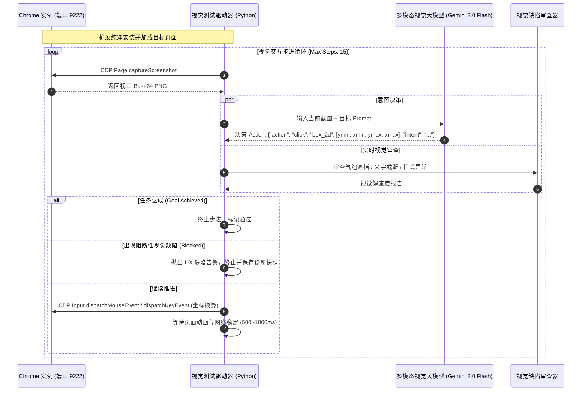
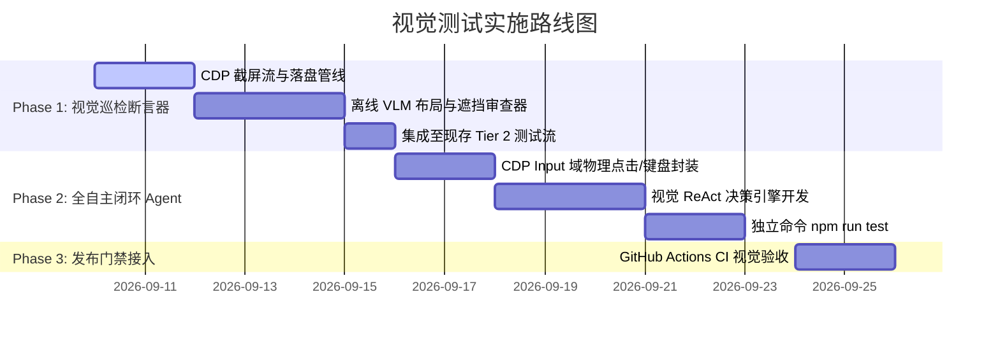

# Gemini Exporter — 纯视觉端到端测试方案设计 (Visual Agent E2E Testing RFC)

> **文档状态**：PROPOSED  
> **适用版本**：v1.4.x+  
> **核心定位**：作为发版前（Pre-Release Gate）或重大 UI 重构后的“零先验可用性盲测”（Zero-Context UX & Visual Auditor）。

---

## 目录
1. [背景与痛点分析 (Why Visual Testing?)](#一背景与痛点分析)
2. [核心原则与设计假设 (Core Principles)](#二核心原则与设计假设)
3. [系统整体架构与执行闭环 (System Architecture)](#三系统整体架构与执行闭环)
4. [底层交互与通信协议实现 (Protocol & Mechanics)](#四底层交互与通信协议实现)
5. [视觉定位与空间意图解析 (Visual Grounding)](#五视觉定位与空间意图解析)
6. [测试场景与双重断言维度 (Scenarios & Assertions)](#六测试场景与双重断言维度)
7. [分期实施路线图 (Implementation Roadmap)](#七分期实施路线图)
8. [成本、时延与稳定性治理 (Governance)](#八成本时延与稳定性治理)

---

## 一、背景与痛点分析

Gemini Exporter 现已建立起严密的双层测试体系：
* **Tier 1（无头快速门禁）**：TypeScript 严格类型检查 + 24 个单测套件 + esbuild 构建 + 22 个 Playwright E2E 用例；
* **Tier 2（真机实跑全流程）**：基于 CDP 原生重装、向导验证、5 轮真实多模态问答、Takeout 导入合流与逐字断言。

### 现有自动化测试的固有盲区
尽管覆盖率极高，现有的白盒/灰盒 E2E 测试均高度依赖 **DOM 选择器**（如 `#btnIncrementalScan`、`.tour-popover`、`#list .item`），这种机制存在三个无法回避的盲区：

1. **“物理遮挡与样式穿透”假阳性**：
   DOM 树上的元素即使被弹窗、引导气泡遮挡，或因 CSS 异常（`opacity: 0`、层级塌陷）不可见，脚本直接执行 `.click()` 或 CDP 脚本求值仍然可以触发事件。测试显示“通过”，但真实用户眼睁睁看着按钮被挡住无法点击。
2. **无法评估交互自明性（Affordance）与引导易用性**：
   代码写死的选择器替代了“人类找按钮”的过程。无法检验界面布局的视觉层级、箭头指向、文案表达是否能够让初次接触的用户在不看源码的前提下顺畅完成操作。
3. **DOM 脆弱性与重构阻力**：
   UI 组件库升级或 HTML 结构重构时，即使功能和视觉完全正常，只要 Class 或结构微调，传统选择器就会大面积报错。

**结论**：引入**纯视觉 Agent 盲测**，模拟真实人类视线与物理光标，是对现有双层测试体系的关键补充。

---

## 二、核心原则与设计假设

```text
┌─────────────────────────────────────────────────────────────┐
│                    纯视觉 Agent 运行约束                     │
│                                                             │
│  ❌ 严禁注入任何 JavaScript 脚本到被测页面                   │
│  ❌ 严禁传入任何 DOM 选择器、元素 ID、Class 或内部状态      │
│  ❌ 严禁使用系统物理鼠标夺取桌面焦点 (必须仅在 Chrome 视口内) │
│                                                             │
│  ✅ 唯一的感知输入：渲染后的高清视口截图 (PNG 图像流)        │
│  ✅ 唯一的决策依据：通用视觉语言模型 (VLM) 的人类常识理解    │
│  ✅ 唯一的交互手段：CDP Input 硬件仿真指令 (按坐标点击/输入)  │
└─────────────────────────────────────────────────────────────┘
```

1. **零先验知识（Zero-Context Assumption）**：
   Agent 扮演一个“第一次安装扩展的普通用户”，仅被赋予最顶层的任务目标（例如：“完成初始化，并将最近的 Gemini 聊天导出为 ZIP”）。
2. **纯像素空间交互（Pixel-Space Interaction）**：
   操作目标只能以二维空间坐标 `(x, y)` 表达，所有事件均经过 Chrome Blink 渲染引擎底层的真实 **Hit-Testing（碰撞测试）**。

---

## 三、系统整体架构与执行闭环

整个系统采用典型的 **Visual ReAct（Perception ➔ Reasoning ➔ Action）** 闭环设计：



---

## 四、底层交互与通信协议实现

我们扩展现有的 `scripts/cdp_client.py`，利用 Chrome DevTools Protocol 原生 `Input` 域模拟真实输入，**不污染操作系统物理鼠标，支持后台窗口与无头模式运行**。

### 1. 核心交互指令实现规范

```python
class VisualCDPController:
    """基于 CDP Input 域的纯视觉物理仿真交互器"""
    def __init__(self, cdp_connection, viewport_width=1280, viewport_height=800):
        self.cdp = cdp_connection
        self.vp_w = viewport_width
        self.vp_h = viewport_height

    def capture_viewport(self) -> bytes:
        """获取当前视口的未经压缩的高清截图"""
        res = self.cdp.call("Page.captureScreenshot", {
            "format": "png",
            "captureBeyondViewport": False
        })
        return base64.b64decode(res["data"])

    def physical_click(self, x: float, y: float, click_count: int = 1):
        """
        触发真正的物理碰撞点击：
        先派发移动事件触发 :hover，再派发按下与抬起事件
        """
        ix, iy = int(x), int(y)
        # 1. 光标移入 (触发 CSS hover 与焦点状态)
        self.cdp.call("Input.dispatchMouseEvent", {
            "type": "mouseMoved", "x": ix, "y": iy
        })
        # 2. 物理按下
        self.cdp.call("Input.dispatchMouseEvent", {
            "type": "mousePressed", "x": ix, "y": iy,
            "button": "left", "clickCount": click_count
        })
        time.sleep(0.05)
        # 3. 物理抬起 (若上方有遮罩，事件将准确被遮罩层捕获)
        self.cdp.call("Input.dispatchMouseEvent", {
            "type": "mouseReleased", "x": ix, "y": iy,
            "button": "left", "clickCount": click_count
        })

    def physical_type(self, text: str):
        """模拟键盘敲击输入"""
        self.cdp.call("Input.insertText", {"text": text})

    def physical_scroll(self, x: float, y: float, delta_y: int):
        """模拟鼠标滚轮滚动"""
        self.cdp.call("Input.dispatchMouseEvent", {
            "type": "mouseWheel",
            "x": int(x), "y": int(y),
            "deltaX": 0, "deltaY": delta_y
        })
```

---

## 五、视觉定位与空间意图解析

为了确保 AI 在不读取 DOM 的情况下精确定位按钮中心，系统设计双轨定位引擎：

### 轨道 A：原生视觉几何定位（推荐优先采用）
现代多模态模型（如 **Gemini 2.0 Flash / Pro**）原生具备像素空间几何坐标感知能力。

* **Prompt 设计**：
  ```text
  你是一名初次使用此浏览器扩展的用户。你的目标是：【完成新手向导并启动增量扫描】。
  请审视当前截图：
  1. 解释你当前看到了什么界面元素（包括高亮气泡、按钮、提示文本）；
  2. 决定你下一步应当采取的动作；
  3. 如果是点击，请给出点击目标的二维边框坐标 [ymin, xmin, ymax, xmax]，归一化范围 0 ~ 1000。
  
  输出 JSON 格式：
  {
    "analysis": "当前处于向导第 2 步，高亮气泡指向了'增量同步'按钮...",
    "action": "click",
    "box_2d": [180, 720, 220, 810],
    "is_blocked": false,
    "block_reason": null
  }
  ```
* **坐标转换逻辑**：
  ```python
  ymin, xmin, ymax, xmax = box_2d
  target_x = ((xmin + xmax) / 2.0) / 1000.0 * viewport_width
  target_y = ((ymin + ymax) / 2.0) / 1000.0 * viewport_height
  controller.physical_click(target_x, target_y)
  ```

### 轨道 B：Set-of-Marks (SoM) 标注增强（高容错后备）
若纯坐标预测在微小图标（如 16x16 勾选框）上出现漂移，可使用 OpenCV / 边缘检测在截图候选可交互区块打上半透明数字编号（`[1]`, `[2]`, `[3]`），让 VLM 直接回复目标标号，准确率可达 99.5% 以上。

---

## 六、测试场景与双重断言维度

### 1. 核心盲测场景规划

| 场景编号 | 场景名称 | 任务 Prompt（注入给 Agent） | 预期完成步数 | 成功判定标准 |
| :--- | :--- | :--- | :--- | :--- |
| **SC-V1** | **全新安装 5 步向导盲测** | “你刚安装了插件，请根据屏幕引导一步一步完成初始化向导，直到向导浮层完全关闭。” | ≤ 7 步 | 气泡完全销毁，`has_completed_tour` 持久化落盘 |
| **SC-V2** | **Options 对话多选与导出** | “请在管理列表中勾选前 2 个会话，并启动导出为 ZIP 压缩包。” | ≤ 6 步 | 浏览器触发文件下载，收到 ZIP 字节流 |
| **SC-V3** | **离线 Takeout 导入引导** | “系统提示扫描达到上限，请找到导入离线 Takeout 备份的入口并触发导入。” | ≤ 4 步 | 导入模态框成功拉起且未遮挡主内容 |

---

## 二、双重断言体系（Dual-Assertion Architecture）

本方案不仅仅断言“最终结果”，更断言“交互过程中的视觉品质”：

```text
┌─────────────────────────────────────────────────────────────┐
│                       双重断言体系                          │
├──────────────────────────────┬──────────────────────────────┤
│      1. 任务达成度断言       │      2. 感知视觉品质断言     │
│   (Functional Goal Met)      │   (Perceptual UI/UX Quality) │
├──────────────────────────────┼──────────────────────────────┤
│ • 目标是否在最大限制步数内完成│ • 引导气泡是否遮挡被引导的按钮│
│ • 关键状态是否落盘 (Storage) │ • 文本是否存在截断或换行溢出 │
│ • 最终产物 (ZIP) 是否有效    │ • 弹窗暗色遮罩是否正确阻断背景│
│ • 是否产生未处理的控制台异常 │ • 按钮对比度是否满足 WCAG 规范│
└──────────────────────────────┴──────────────────────────────┘
```

#### 视觉遮挡断言示例（AI 自检 Prompt）：
```text
请专门审查：当前指示气泡（Tooltip / Popover）是否遮挡了它所指向的目标按钮？
如果气泡的矩形区域覆盖了目标按钮的点击中心点，请判定为 FAIL 并说明："Tooltip obscures target CTA"。
```

---

## 七、分期实施路线图



* **第一阶段（低成本快赢：视觉巡检断言器）**：
  * 无需改变现有自动化脚本的操作链路；
  * 脚本在现有每一步操作完成后（如点击向导前、扫描完成后、弹窗显示时）截取高清视口图并归档；
  * 测试结束后，将整套截图批量发送至 Gemini 2.0 Flash，产出一份完整的**《UI 视觉与排版缺陷审查报告》**。
* **第二阶段（完全自主视觉 Agent：Zero-Context E2E）**：
  * 在 `scripts/` 下新增 `scripts/test_visual_agent.py`；
  * 配置独立命令 `npm run test:visual`，实现真正无 DOM 代码依赖的纯像素级自主操作与盲测。

---

## 八、成本、时延与稳定性治理

1. **时延与性能考量**：
   * 采用 **Gemini 2.0 Flash** 视觉模型，单次多模态推理耗时约 **600ms ~ 900ms**；
   * 一套包含 6~8 步交互的完整流程总耗时约 **15 ~ 25 秒**，完全满足本地实跑与发布门禁要求。
2. **API 成本治理**：
   * Gemini Flash 视觉输入按 Token 计费，单张 1280x800 截图消耗约 258 Tokens；
   * 运行一次完整视觉全流程测试（约 10 步）总消耗不足 4,000 Tokens，单次运行成本低于 $0.001，具备极佳的经济可行性。
3. **死循环与动作漂移熔断（Safety Guardrail）**：
   * 设定单用例严格最大步数上限（如 `MAX_STEPS = 15`）；
   * 若连续 3 步点击同一屏幕坐标未引起视觉画面变动（SSIM 相似度 > 0.98），立即熔断判定为 `STUCK_LOOP` 并输出诊断日志；
   * 自动将每一步操作前后的画面合成动态 GIF 或生成逐帧 HTML 回放报告，便于人工秒级复盘定位。

---

## 九、附录：快速原型伪代码 (Minimal Proof-of-Concept)

```python
#!/usr/bin/env python3
# scripts/test_visual_poc.py
import json, base64, time
from scripts.cdp_client import CDPConnection, get_tabs

def run_visual_step(cdp, goal, vlm_client):
    # 1. 纯视觉截屏
    shot_data = cdp.call("Page.captureScreenshot", {"format": "png"})["data"]
    
    # 2. 送入 VLM 决策 (例如 Gemini 2.0 Flash)
    decision = vlm_client.generate_action(image_b64=shot_data, goal=goal)
    print(f"🤖 AI 意图: {decision['analysis']}")
    
    if decision["is_finished"]:
        return True
        
    if decision["action"] == "click":
        # 归一化坐标转像素
        ymin, xmin, ymax, xmax = decision["box_2d"]
        px = int(((xmin + xmax) / 2.0) / 1000.0 * 1280)
        py = int(((ymin + ymax) / 2.0) / 1000.0 * 800)
        
        # 3. 原生 CDP 物理点击
        cdp.call("Input.dispatchMouseEvent", {"type": "mouseMoved", "x": px, "y": py})
        cdp.call("Input.dispatchMouseEvent", {"type": "mousePressed", "x": px, "y": py, "button": "left", "clickCount": 1})
        cdp.call("Input.dispatchMouseEvent", {"type": "mouseReleased", "x": px, "y": py, "button": "left", "clickCount": 1})
        time.sleep(1.0)
        
    return False
```
