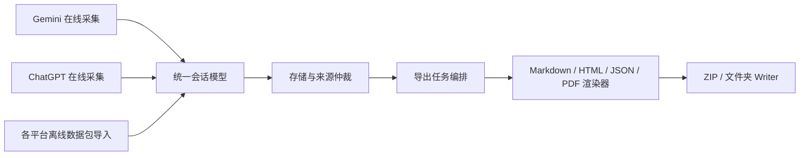

# Gemini Exporter 长期演进实施方案

> 状态：实施计划，尚未开始改造
>
> 编制日期：2026-09-25
>
> 范围：现有问题治理、模块与数据收拢、ChatGPT 接入、本地静默批量 PDF 导出、三层测试与发布门禁

## 1. 目标、约束与实施原则

本方案的目标是让 Gemini Exporter 在继续维护现有 Gemini 功能的同时，具备接入更多 AI 平台和更多导出格式的空间。实施顺序固定为：先修复现有测试和数据风险，再稳定共享契约，最后并行开发 ChatGPT 与 PDF。每阶段均以可验证的交付物结束，不以“代码已写完”作为完成标准。

产品约束：

- 发布形态是可上架 Chrome Web Store 的 Manifest V3 扩展。用户只需安装扩展；PDF 不依赖 `chrome.debugger`、调试模式、远程服务或本机辅助程序。
- 批量 PDF 导出在本地生成文件，不逐份弹出打印对话框。完整性、可搜索文字、账户隔离优先于与网页像素级一致。
- 保持既有 Gemini 用户数据和导出行为可用。存储迁移必须幂等、可审计，并提供失败回退路径。
- 测试尽量自动运行并自动判定。外部账号、网站或视觉模型不可用时报告 `BLOCKED`，不得报告 `PASS`。
- 实施遵循仓库 [AGENTS.md](../AGENTS.md)：主目录保持 `main` 干净；每个改动在独立 worktree 中完成，提交 PR 并经过项目规定的门禁与自动合并流程。

## 2. 当前起点与待解决的问题

| 领域 | 已有能力 | 当前缺口 |
| --- | --- | --- |
| 平台 | `src/core/provider/` 已有 Provider 接口、Gemini 实现和休眠的 ChatGPT 映射器 | ChatGPT 未被 manifest 接入；列表入口休眠；导出抓取仍使用 Gemini 专用标签页与 URL；接口广泛使用 `any` |
| 数据 | `chrome.storage.local` 保存元数据，IndexedDB 保存详情；已有跨标签写入保护和迁移框架 | 键名及账户槽位带 Gemini 语义；明细以裸会话 ID 为键；通用模型混入平台字段；跨平台身份尚未闭合 |
| 导出 | Markdown、HTML、JSON 已有；ZIP 和文件夹 Writer 接受字符串或二进制 | `formatContent` 当前仅返回字符串；格式白名单分散；导出状态未按平台、账户、格式和内容版本建模 |
| HTML / PDF | HTML 模板已有打印样式 | HTML 模板含交互、懒加载图片及 Gemini 特定视觉；无法直接等同可批量生成的 PDF |
| Tier 1 | 类型检查、单测、构建、Playwright、增量影响分析 | 增量测试只是开发反馈；应对未知依赖、共享模型和构建变更保守回退全量 |
| Tier 2 | 真实 Chrome 生命周期测试、DAG 调度、落盘 ZIP 规范断言 | 最终结果只强制检查 `critical`；部分关键用例把未执行的条件分支记为成功；场景执行前即出队归档 |
| Tier 3 | 纯截图操作靶场、自主 Agent、审计报告 | `test:visual` 靶场就绪即可返回成功；Agent 可在无独立验收函数时以 `DONE` 宣告通过 |

关键代码入口：[`src/types/conversation.ts`](../src/types/conversation.ts)、[`src/core/storage/storageService.ts`](../src/core/storage/storageService.ts)、[`src/core/storage/conversationDetailStore.ts`](../src/core/storage/conversationDetailStore.ts)、[`src/core/engine/export/exportOrchestrator.ts`](../src/core/engine/export/exportOrchestrator.ts)、[`src/core/engine/writers/writerInterface.ts`](../src/core/engine/writers/writerInterface.ts)、[`scripts/framework/cases/base.py`](../scripts/framework/cases/base.py)、[`scripts/visual_agent/agent.py`](../scripts/visual_agent/agent.py)。

## 3. 目标架构与唯一事实来源

**结构化会话是唯一事实来源。** 平台原始响应只属于适配器；HTML、Markdown、JSON 和 PDF 都是从会话模型生成的产物，不能反过来成为数据存储的权威来源。HTML 中积累的内容与视觉规则可供 PDF 设计参考，但 PDF 引擎不应依赖解析整页 HTML 来恢复消息语义。

建议固定以下边界：

1. **Identity**：`providerId + accountId + providerConversationId` 组成持久身份。原始 ID 只在所属 Provider 内做规范化。存储、明细、导出记录、附件和同步游标使用同一身份。文件名由安全的展示名称和身份摘要生成。
2. **Provider**：负责就绪状态、分页列表、详情、资源获取、平台错误映射及能力声明。通用编排器不能调用 `getGeminiTab`、拼 Gemini URL 或理解平台 RPC。
3. **Conversation**：通用字段只包含身份、标题候选及来源、消息、时间来源、附件引用和同步状态。Gemini 特有字段放入带命名空间的平台扩展。缺失值、未知内容和无法取得的附件必须显式表示。
4. **Repository**：`chrome.storage.local` 是轻量索引与偏好的存储；IndexedDB 是完整消息和资源元数据的存储。两层由统一仓储 API 协调，不允许 UI 与 Provider 各自推导另一套会话状态。
5. **Export**：按“读取/补齐 → 资源准备 → 格式渲染 → Writer 落盘 → 提交导出记录”运行。渲染器返回异步 `ExportArtifact`，其内容可为 `string | Blob | Uint8Array`；Writer 只负责写入，不理解平台和格式。
6. **ExportRecord**：至少记录身份、格式、内容修订标识、落盘结果和导出时间。某会话已导出 HTML 不意味着已导出 PDF；写文件失败不得标记成功。

## 4. 分阶段实施

### 阶段 0：可信基线和现有问题治理

**0.1 锁定既有行为。** 保存脱敏的旧版存储夹具、真实导出 ZIP、Gemini 多模态会话和长会话样本。记录会话数、消息数、标题来源、账户槽位、导出标记与附件状态。运行现有 Tier 1，并记录任何已知失败；不把现有文档中的用例数量当作实时事实。

**0.2 修正 Tier 2 结果语义。** 每次运行先声明必测能力和测试配置。每项结果为 `PASS / FAIL / BLOCKED / NOT_APPLICABLE`；依赖失败、场景未匹配、配置未开启均不能被伪装为 PASS。默认完整运行的必测项必须全部 PASS；有意裁剪的子图另标 `partial run`，不能冒充全流程通过。会话 1 基准导出等前置动作失败时立即留下失败证据，不继续给下游“成功”。

**0.3 修正 Tier 3 围栏。** 将“打开靶场”和“执行验收”分为不同入口与退出码。纯视觉 Agent 只获得截图、鼠标、键盘、滚动和等待能力；目标是否完成由宿主独立判定。宿主复用 Tier 2 中稳定的文件、ZIP、存储及状态断言，不把 DOM 或断言内部数据交给 Agent。没有验收函数、没有证据、Agent 自称 `DONE`、超时或资源不可用，都不能 PASS。视觉体验评分单独输出为审计意见，不作为功能门禁的唯一依据。

**0.4 调整场景池与增量测试。** 固定回归样本与探索题库分离。题目领取、执行、提交结果分步记录；中断不丢失题目，补仓不要求 AI 临场写入仓库才能继续验证。`test:changed` 作为开发快速反馈；遇到无法解析的依赖、共享类型、存储迁移、构建配置或测试框架改动，回退全量。PR 保持完整 Tier 1 验证。

**阶段出口：** 故意触发关键断言失败、让 Agent 不操作直接 `DONE`、让 Tier 2 缺少必需环境，三者都不会退出为 0；报告包含机器可读状态、失败原因和产物路径。核对 `.github/workflows/`、GitHub 必需检查与文档，消除“文档说已设门禁、实际未执行”的偏差。

### 阶段 1：跨平台身份、会话模型与安全迁移

**1.1 身份与隔离。** 引入复合身份，覆盖列表索引、IndexedDB 明细、附件缓存、导出记录、删除、同步游标和 UI 选择状态。Gemini 的历史 `u0` / `gemini_*` 数据按明确映射读取；新平台不得共享裸 ID 键。账户 ID 不应仅依赖易变的显示名称。

**1.2 统一模型。** 为消息角色、分支/编辑、时间戳来源、标题候选、附件状态定义严格类型。标题权威仲裁在一处执行；Provider 提交带来源的候选，不自行覆盖最终标题。禁止用当前时间填补未知的服务端时间。对无法映射的内容保存诊断信息，避免静默丢弃。

**1.3 迁移策略。** 按“旧版快照和契约测试 → 新读路径兼容旧键 → 新写路径启用 → 幂等校验 → 延后清理旧键”的顺序分 PR。迁移失败时保留旧数据、停止破坏性写入并提示恢复。验证升级、重复启动、部分迁移中断、两个账户同名会话、Gemini 与 ChatGPT 同原始 ID。

**阶段出口：** 旧 Gemini 夹具在迁移前后保持会话、消息、标题和导出记录数量一致；跨平台、跨账户同 ID 不串号；迁移重复执行结果相同；回滚说明可实际执行。

### 阶段 2：模块契约与导出收拢

**2.1 Provider 收拢。** 移除通用导出和工作台对 Gemini 标签页、URL、账号槽位及错误文本的直接依赖。`AIProvider` 改为明确的请求上下文、分页游标、可取消操作和类型化结果；能力以可组合项声明，例如列表、详情、实时感知、离线导入和资源下载。休眠能力不在 UI 宣称可用。

**2.2 导出管线收拢。** 将格式注册表作为格式 ID、扩展名、MIME、UI 选项和渲染入口的唯一来源。渲染器支持异步二进制产物；继续使用现有 Writer 的 `Blob` 支持。任务编排负责取消、进度、资源失败隔离和导出记录提交；主文件及所需资源写入失败时该会话不得标记完成。

**2.3 UI 与索引收拢。** 工作台按 Provider 和账户过滤；列表、批量选择、索引、元数据与文件名显示真实平台来源。Gemini 专属文字保留在 Gemini 功能内部。格式可用性根据渲染器能力展示；PDF 未通过阶段 3B 前隐藏或标为未开放。

**2.4 架构防回退。** 为 Provider、Repository、Renderer、Writer 建契约测试；加入依赖方向检查：通用模块不得导入 Gemini/ChatGPT 私有实现。通过一个假 Provider 和一个假二进制 Renderer 验证扩展点，无需修改导出主流程。

**阶段出口：** 假 Provider 可完成列表、详情和 HTML/Markdown 导出；假二进制 Renderer 可写入 ZIP 与文件夹；原 Gemini Tier 1 和目标 Tier 2 全绿。此时冻结共享契约，ChatGPT 与 PDF 开始并行。

### 阶段 3A：ChatGPT 接入

| 迭代 | 具体工作 | 必须验收 |
| --- | --- | --- |
| A1 离线数据包 | 用脱敏的 ChatGPT 导出样本完善已有树形映射；处理当前分支、编辑、系统消息、图片/文件、空节点与未知内容 | 消息顺序、标题、时间、附件状态可与样本核对；重复导入不重复；坏包有明确错误 |
| A2 平台与账户 UI | 加入平台、账户选择；导入后的 ChatGPT 会话进入统一列表与现有格式导出 | Gemini 和 ChatGPT 同 ID 不串号；索引及导出文件标明来源；权限未开启时不显示在线能力 |
| A3 在线只读同步 | 验证登录、列表分页、详情、限流、取消、断点恢复和协议漂移检测；加入最小必要的站点权限 | 接口异常时明确失败，不写空会话；中断后继续；真实测试账号通过 Tier 2 子集 |
| A4 实时与附件 | 分别实现并验证新消息感知、删除处理、附件获取；无法可靠提供的能力保持关闭 | 每项有独立能力声明、契约测试、真实环境验收和回退行为 |

现有 `ChatGPTProvider` 只是休眠预留；增加 manifest 匹配并不等于完成接入。在线采集使用的网站内部接口可能变化，应由漂移检测和能力降级保护。优先交付可单独使用的 A1+A2；A3/A4 经验证后再开放。OpenAI 官方数据导出可作为离线导入来源，但其账户和工作区可用范围并不完全相同：<https://help.openai.com/en/articles/7260999-exporting-your-chatgpt-history-and-data>。

### 阶段 3B：本地静默批量 PDF

| 迭代 | 具体工作 | 必须验收 |
| --- | --- | --- |
| B1 引擎验证 | 在正式扩展运行环境中比较本地 JS PDF 文档引擎；使用含中英混排、公式、代码、宽表、链接、图片、长对话的样本 | 无调试权限、本机程序、远程转换和打印对话框；文字可选择/搜索；长文不出现空白或截断 |
| B2 排版模型 | 从统一会话模型生成 PDF 文档结构；共享标题层级、颜色、资源引用等设计规则 | 与 HTML/Markdown 的消息及附件清单一致；PDF 不依赖反解析 HTML 字符串 |
| B3 字体、资源、分页 | 本地打包字体；处理中文、特殊符号、图片尺寸、长代码、表格跨页、页眉页脚及缺失资源 | 页面内容完整；资源失败可追溯；字体和引擎许可及包体积可接受 |
| B4 批量集成 | PDF `Blob` 进入已有 Writer；按内存预算限制并发，提供进度、取消、单会话失败隔离与重试 | 多会话批量导出无假成功；成功状态在文件落盘后记录；ZIP 和文件夹输出一致 |
| B5 发布验证 | 在打包后的 MV3 扩展中运行完整流程并检查 CSP、离线能力和 Chrome Web Store 包 | 用户仅安装扩展即可本地静默批量生成 PDF |

不以 `window.print()` 或 `chrome.printing` 实现此目标。HTML 已有打印样式，但交互组件、懒加载资源和分页规则需要单独审计。把整个 HTML 截成图片再塞入 PDF 的捷径不适合长会话存档：html2pdf.js 项目明确说明该方式文字不可搜索，且受 Canvas 尺寸限制：<https://github.com/eKoopmans/html2pdf.js/>。可把 pdfmake 等支持浏览器本地生成 `Blob` 的引擎纳入 B1 比较，但选型以真实样本结果为准：<https://pdfmake.github.io/docs/0.3/getting-started/client-side/methods/>。

## 5. 并行边界与合流规则

阶段 0—2 必须串行完成并冻结 Identity、Conversation、Provider、ExportArtifact 与 ExportRecord 契约。之后 3A 与 3B 在不同 worktree 并行：

- ChatGPT 分支只改平台适配器、平台权限与平台 UI；PDF 分支只改文档渲染器、格式注册和排版资源。
- 任何需要修改共享模型或导出编排接口的发现，先提交一个独立的基础契约 PR，两个分支同步更新后继续。避免各自引入不兼容字段。
- 两条线分别集成进主线，最后做混合平台与混合格式回归；不要求 A4 实时能力完成才能发布已验证的 A1+A2，也不要求 ChatGPT 在线同步完成才能发布 PDF。

建议 PR 顺序：

1. Tier 2 状态与必测能力矩阵。
2. Tier 3 真执行入口和独立验收围栏。
3. 场景池、增量测试回退与 CI 文档一致性。
4. 复合身份、旧数据兼容读取和迁移测试。
5. 统一会话模型、标题/时间/附件来源规则。
6. Provider 契约及 Gemini 专用路径回迁。
7. 异步导出产物、格式注册表和按格式导出记录。
8. 工作台平台感知、假 Provider/Renderer 契约测试。
9. A1、A2、A3、A4 分 PR 推进；B1、B2、B3、B4、B5 分 PR 推进。
10. 双线集成与发布候选版本回归。

## 6. 三层测试在各阶段的职责

| 层级 | 负责发现的问题 | 门禁方式 | 产物 |
| --- | --- | --- | --- |
| Tier 1 | 类型、模型映射、迁移、合并、格式契约、写入、扩展 UI 集成 | 每个 PR 全量执行；增量测试用于开发反馈 | 测试报告、构建包、失败夹具 |
| Tier 2 | 真实网站采集、登录状态、流式完成、Takeout/ChatGPT 导入、磁盘导出、跨账户状态 | 受影响功能的预声明必测能力全部 PASS；外部环境不可用为 BLOCKED | 机器可读矩阵、真实下载产物、日志 |
| Tier 3 | 真实视觉操作路径与体验问题 | 仅在有独立验收器的目标上作为功能门禁；主观 UX 评价另列 | 截图、动作轨迹、独立验收结果、UX 报告 |

对 PDF 增加内容与结构断言：文件可解析、页数合理、文本可提取、全部消息标记及顺序存在、关键图片实体存在、无空白页/异常截断。视觉回归用代表性页面的截图差异辅助排查，但不取代内容断言。对 ChatGPT 增加树形分支与跨账户夹具，真实在线能力按 A3/A4 分别测试。

真实网站和视觉模型受外部状态影响，自动化的目标是**无人值守执行且结果诚实**，不是保证任何情况下都能绿色通过。首次测试账号准备及环境维护仍需明确责任人；测试运行不能自动修改用户数据或把敏感导出包提交到仓库。

## 7. 最终发布验收清单

- [ ] 旧 Gemini 存储升级、重复迁移、恢复和导出均无数据丢失。
- [ ] Gemini 与 ChatGPT、两个账户及相同原始会话 ID 完全隔离。
- [ ] 每个已开放的平台能力都有明确失败和降级状态；未完成的能力不在 UI 宣称支持。
- [ ] Markdown、HTML、JSON 既有行为保持；新增 PDF 不改变采集逻辑。
- [ ] PDF 在商店版扩展中本地静默批量生成，文字可搜索、中文可用、长文和多模态内容完整。
- [ ] ZIP/文件夹导出失败时不产生错误的“已导出”状态；取消和重试可预测。
- [ ] Tier 1 全绿；受影响的 Tier 2 必测项全绿；Tier 3 目标有独立验收证据。
- [ ] 权限、CSP、包体积、第三方字体/引擎许可和 Chrome Web Store 发布包完成检查。
- [ ] 用户文档、隐私说明、架构文档及测试文档与实际行为一致。

## 8. 执行中的主要风险与决策点

1. **ChatGPT 在线协议变化**：A1+A2 先形成可发布的离线导入能力；A3 只在真实测试稳定且漂移处理完成后开放。
2. **存储迁移造成覆盖或串号**：阶段 1 采用兼容读取、分步写入、幂等校验，不做一次性删除旧键。
3. **PDF 引擎能力不足**：B1 是独立的选型门；达不到可搜索文字、中文字体和长文完整性要求，就更换引擎或缩小首版支持范围，不用截图 PDF 冒充成功。
4. **MV3 内存与生命周期**：B4 串行或有限并发处理大文件，记录任务进度和每会话结果，避免整批产物常驻内存。
5. **测试假绿**：始终区分功能断言、环境阻塞和主观视觉报告；任何关键证据缺失都不得 PASS。

完成本方案后，新增平台应主要增加 Provider 与映射测试；新增格式应主要增加 Renderer 与格式测试。存储身份、导出编排和 Writer 不应随每次扩展而重复改造。
