# Gemini Exporter 测试架构与规范指南 (Three-Tier Testing Architecture & Guide)

本项目构建了严密、分层的**三层测试体系 (Three-Tier Testing Architecture)**，兼顾了 CI 自动化门禁的极致速度与生产环境真实链路的绝对可靠性。无论是人类开发者还是 AI 编程助手，在进行功能开发、Bug 修复或重构时，均须严格遵守本规范。

---

## 一、三层测试体系架构总览

```mermaid
flowchart TD
    subgraph Tier1 [第一层：CI 自动化极速门禁 Tier 1 - Fast & Headless Gate]
        T1_A["python3 tests/run_tests.py<br>37 个 TypeScript/Node 行为单元测试套件"]
        T1_B["npx playwright test<br>15 个 Spec 文件 / 34 个无头端到端测试 (~20秒)"]
        T1_A --> T1_PASS["CI 极速门禁通过 (~25秒)"]
        T1_B --> T1_PASS
    end

    subgraph Tier2 [第二层：真实 Chrome 特性驱动 E2E Tier 2 - Live Debug Staging]
        T2_CDP["./scripts/open_test_chrome.sh<br>独立调试 Chrome + CDP 9222 端口"]
        T2_DAG["DAGRunner 拓扑依赖调度器<br>19 大模块化 Feature 局部容灾解耦"]
        T2_Life["完整生命周期闭环<br>安装 -> 向导 -> 会话 -> 基准导出 -> 追加置顶 -> 瞬态删除 -> Takeout 合流 -> 卸载"]
        T2_Asserter["ExportSpecificationAsserter<br>物理解压 ZIP + 字节级严格断言 (零 Storage 篡改后门)"]
        T2_CDP --> T2_DAG --> T2_Life --> T2_Asserter
    end

    subgraph Tier3 [第三层：纯视觉 Agent 盲测 Tier 3 - Pure Visual Agent]
        T3_Provider["可插拔模型驱动 (VisionProvider)<br>Gemini Vision / SubAgent / Heuristic 插件化"]
        T3_Loop["看-想-动-验 物理事件闭环<br>截屏 PNG -> 模型推算坐标 -> CDP 硬件级鼠标事件"]
        T3_SelfHeal["自愈引擎 (Self-Healing Engine)<br>感知阻碍 -> 自动退避等待 -> 重新识别重试"]
        T3_Report["结构化 UX 体验报告<br>visual_audit_scorecard.md + visual_audit_report.html"]
        T3_Provider --> T3_Loop --> T3_SelfHeal --> T3_Report
    end
```



---

## 二、第一层：CI 自动化门禁测试 (Tier 1: Fast & Headless Gate)

### 1. 定位与设计原则
* **轻量极速**：完全在本地与 GitHub Actions 虚拟无头环境中运行，无须连接外网，无须真实 Google 账号。
* **100% 行为真断言**：彻底杜绝仅检查 `typeof === 'function'` 的假门面断言与源码文本正则匹配，通过构造具有完整 DOM 树与真实层级结构（折叠 recent 列表、滚动容器、会话链接树）的测试夹具，真实调用模块 API。
* **执行总耗时**：~20 秒完成 37 个单测套件 + 34 个 Playwright 端到端用例。

### 2. 运行命令
```bash
# 执行完整 CI 门禁（类型检查 + 37 个单测 + 构建打包 + 34 个无头集成用例）
npm test

# 或分别单独执行
npm run test:unit    # 运行 python3 tests/run_tests.py (37 个单元测试套件)
npm run test:e2e     # 运行 npx playwright test (34 个 Playwright 用例)
```

### 3. 测试覆盖范围
* **核心解析与状态管理**：`gemini_parser`、`takeout_engine`、`conversation_order`、`conversations_store`、`chat_formatter`、`format_store` 等；
* **网络与恢复机制**：`gemini_client_retry`（HTTP 400 XSRF 重试、AbortSignal 干净终止、多页游标分页）、`storage_service`、`message_bridge`；
* **端到端完整格式导出**：`export_zip.spec.ts`（Markdown 格式导出与解压断言）、`json_export.spec.ts`（JSON OpenAI 格式导出与结构/角色断言）、`takeout_limit_prompt.spec.ts`、`page_sync.spec.ts`、`workbench_ui.spec.ts` 等。

---

## 三、第二层：真实调试 Chrome 全流程实跑测试 (Tier 2: Live Debug Staging)

### 1. 定位与设计原则
* **DAG 拓扑调度与故障局部隔离**：打破 778 行单体巨石，抽象 `FeatureTestCase` 与 `DAGRunner`，各特性根据 `prerequisites` 动态解析拓扑顺序。若发帖因外网波动失败，下游无依赖特性（Takeout 导入、Deep Scan 同步、搜索过滤、多语言切换）依然独立无损执行。
* **彻底铲除 Storage 篡改后门**：绝对禁止直接在控制台执行 `chrome.storage.local.set` 伪造导出时间戳。通过真实的业务生命周期：
  `会话 1 生成 ➔ 真实触发一轮导出落盘 ➔ 会话 1 追加提问 ➔ Options 页面通过真实 STREAM_COMPLETE 事件自然获得已更新徽章与置顶升权`。
* **生命周期两端完整闭环**：包含从扩展安装、新手向导、实时发帖、老会话置顶、瞬态删除清理、Takeout 合流，到扩展彻底卸载（Uninstall）与隔离清理的完整闭环。

### 2. 运行命令
```bash
# 启动独立调试 Chrome (端口 9222)
./scripts/open_test_chrome.sh          # macOS / Linux
.\scripts\open_test_chrome.ps1         # Windows PowerShell

# 首选标准模式：从场景池消费 2 个最新多模态场景运行全流程
npm run test:live:pool

# 人工本地调试或离线复现模式（绕过 2 分钟时效门禁）
npm run test:live:local
```

---

## 四、第三层：纯视觉 AI 盲测与 UX 质检体系 (Tier 3: Pure Visual Agent)

### 1. 定位与设计原则
* **可插拔 VisionProvider 驱动**：彻底剥离 DOM `querySelector` / `getBoundingClientRect` 坐标偷取与控制台写库后门，定义通用的 `VisionProvider` 抽象基类，支持 `GeminiVisionProvider`、`SubAgentVisionProvider` 与 `HeuristicVisionProvider`。
* **物理级事件派发**：完全由视觉识别给出归一化坐标，由 CDP 派发硬件级物理事件（`mouseMoved` ➔ `mousePressed` ➔ `mouseReleased`）。
* **自愈引擎 (Self-Healing Engine)**：若操作遇阻（如遮罩延迟、过渡动画未就绪），Agent 自动记录自愈日志，执行退避等待（500ms），重新截屏重试。
* **结构化 UX 体检报告**：自动生成 `tests/output/visual_audit/visual_audit_scorecard.md` 与 `visual_audit_report.html`，包含实际体验功能清单、排版截断/视觉风险，以及完整的自愈重试轨迹。

### 2. 运行命令
```bash
# 运行纯视觉全流程闭环实测 (向导 ➔ Takeout 导入 ➔ 物理勾选 ➔ 物理导出 ➔ 规范断言)
npm run test:visual

# 启用 Gemini 2.0 Flash 视觉大模型多模态深度体检报告
python3 scripts/test_visual_agent.py --ai-review
```
