# Gemini Exporter 测试架构与规范指南 (Three-Tier Testing Architecture & Guide)

本项目构建了严密、分层的**三层测试体系 (Three-Tier Testing Architecture)**，兼顾了 CI 自动化门禁的极致速度与生产环境真实链路的绝对可靠性。无论是人类开发者还是 AI 编程助手，在进行功能开发、Bug 修复或重构时，均须严格遵守本规范。

---

## 一、三层测试体系架构总览

```mermaid
flowchart TD
    subgraph Tier1 [第一层：CI 自动化极速门禁 Tier 1 - Fast & Headless Gate]
        T1_A["python3 tests/run_tests.py<br>84 个 TypeScript/Node 行为单元测试套件"]
        T1_B["npx playwright test<br>14 个 Spec 文件 / 35 个无头端到端测试 (~20秒)"]
        T1_A --> T1_PASS["CI 极速门禁通过 (~25秒)"]
        T1_B --> T1_PASS
    end

    subgraph Tier2 [第二层：真实 Chrome 特性驱动 E2E Tier 2 - Live Debug Staging]
        T2_CDP["./scripts/open_test_chrome.sh<br>独立调试 Chrome + CDP 9222 端口"]
        T2_DAG["DAGRunner 拓扑依赖调度器<br>19 大模块化 Feature 局部容灾解耦"]
        T2_Life["完整生命周期闭环<br>安装 -> 向导 -> 会话 -> 基准导出 -> 追加置顶 -> 瞬态删除 -> Takeout 合流 -> 卸载"]
        T2_Asserter["ExportSpecificationAsserter<br>物理解压 ZIP + 字节级严格断言 (零 Storage 篡改后门)"]
        T2_CDP --> T2_DAG --> T2_Life --> T2_Asserter
    end

    subgraph Tier3 [第三层：纯视觉 Agent 盲测 Tier 3 - Pure Visual Agent]
        T3_Provider["双途径架构驱动 (Two Pathways)<br>途径 1: 无 Context 子智能体 (Subagent)<br>途径 2: 自定义/第三方 AI 接口 (Custom AI)"]
        T3_Loop["看-想-动-验 物理事件闭环<br>纯截屏 PNG ➔ 模型视觉推算 ➔ CDP 硬件级键鼠派发"]
        T3_SelfHeal["自愈引擎 (Self-Healing Engine)<br>感知阻碍 ➔ 自动退避等待 ➔ 重新感知重试"]
        T3_Report["结构化 UX 体验报告<br>visual_audit_scorecard.md + visual_audit_report.html"]
        T3_Provider --> T3_Loop --> T3_SelfHeal --> T3_Report
    end
```



---

## 二、第一层：CI 自动化门禁测试 (Tier 1: Fast & Headless Gate)

### 1. 定位与设计原则
* **轻量极速**：完全在本地与 GitHub Actions 虚拟无头环境中运行，无须连接外网，无须真实 Google 账号。
* **100% 行为真断言**：彻底杜绝仅检查 `typeof === 'function'` 的假门面断言与源码文本正则匹配，通过构造具有完整 DOM 树与真实层级结构（折叠 recent 列表、滚动容器、会话链接树）的测试夹具，真实调用模块 API。
* **执行总耗时**：~20 秒完成 84 个单测套件 + 35 个 Playwright 端到端用例。

### 2. 运行命令
```bash
# 执行完整 CI 门禁（类型检查 + 84 个单测 + 构建打包 + 35 个无头集成用例）
npm test

# 或分别单独执行
npm run test:unit    # 运行 python3 tests/run_tests.py (84 个单元测试套件)
npm run test:e2e     # 运行 npx playwright test (35 个 Playwright 用例)
```

### 3. 测试覆盖范围
* **核心解析与状态管理**：`gemini_parser`、`takeout_engine`、`conversation_order`、`conversations_store`、`chat_formatter`、`format_store` 等；
* **网络与恢复机制**：`gemini_client_retry`（HTTP 400 XSRF 重试、AbortSignal 干净终止、多页游标分页）、`storage_service`、`message_bridge`；
* **端到端完整格式导出**：`export_zip.spec.ts`（Markdown 格式导出与解压断言）、`json_export.spec.ts`（JSON OpenAI 格式导出与结构/角色断言）、`takeout_limit_prompt.spec.ts`、`page_sync.spec.ts`、`workbench_ui.spec.ts` 等。

---

## 三、第二层：真实调试 Chrome 全流程实跑测试 (Tier 2: Live Debug Staging)

### 1. 定位与设计原则
* **DAG 拓扑调度与故障局部隔离**：打破 778 行单体巨石，抽象 `FeatureTestCase` 与 `DAGRunner`，各特性根据 `prerequisites` 动态解析拓扑顺序。若发帖因外网波动失败，下游无依赖特性（Takeout 导入、Deep Scan 同步、搜索过滤、多语言切换）依然独立无损执行。
* **彻底铲除 Storage 篡改后门**：绝对禁止直接在控制台执行 `chrome.storage.local.set` 伪造导出时间戳。通过真实的业务生命周期：
  `会话 1 生成 ➔ 真实触发一轮导出落盘 ➔ 会话 1 追加提问 ➔ Options 页面通过真实 STREAM_COMPLETE 事件自然获得已更新徽章与置顶升权`。
* **生命周期两端完整闭环**：包含从扩展安装、新手向导、实时发帖、老会话置顶、瞬态删除清理、Takeout 合流，到扩展彻底卸载（Uninstall）与隔离清理的完整闭环。

### 2. 运行命令
```bash
# 启动独立调试 Chrome (端口 9222)
./scripts/open_test_chrome.sh          # macOS / Linux
.\scripts\open_test_chrome.ps1         # Windows PowerShell

# 标准模式：从场景池消费 2 个最新多模态场景运行全流程实跑测试
npm run test:live
# 或: python3 scripts/test_live_chat_and_export.py
```

---

## 四、第三层：纯视觉 AI 盲测与 UX 质检体系 (Tier 3: Pure Visual Agent)
 
### 1. 定位与双途径架构 (Two Pathways Only)
Tier 3 纯视觉测试专为评估黑盒环境下的真实视觉交互与自主探索而设计。**物理彻底删除了所有硬编码坐标点击与假退出捷径**，仅支持且必须通过以下两大标准途径执行：

* **途径一：无 Context 子智能体自主探索 (Subagent Mode, 首选推荐)**：
  - 由宿主 Agent（如 Antigravity）通过 `invoke_subagent` 拉起一个全新的、**无任何历史上下文污染的子智能体 (`Tier 3 Visual QA Explorer`)**；
  - 子智能体基于纯截屏视觉感知（0 DOM 树访问、0 JS 注入），自主推导目标、调度硬件级鼠标/键盘动作，并在推演完毕后如实沉淀特性清单、自愈轨迹与 UX 风险。
* **途径二：自定义 / 第三方 AI 接口驱动 (Custom AI API Mode)**：
  - 面向未来或外部第三方多模态 AI 接入，通过通用 `CustomAIVisionProvider` 连接兼容 OpenAI 或自建多模态视觉端点（`CUSTOM_AI_ENDPOINT`）；
  - 自动驱动 `AutonomousVisualAgent` 的 ReAct 推演循环完成指定自然语言目标，并可生成在线视觉体检审查报告。

### 2. 受测 AI 受控交互接口 (Strict Interface Isolation - 7 大 CLI 原语)
受测智能体与宿主环境绝对物理隔离，**只能且仅能**通过调用 `scripts/visual_agent/cli.py` 提供的 7 个原子命令来感知和操作界面（0 DOM 泄露，严禁控制台后门）：
1. 📸 **截屏感知**：`python3 scripts/visual_agent/cli.py screenshot --target <options|popup|gemini> [--name <name>]`
2. 🖱️ **物理鼠标点击**：`python3 scripts/visual_agent/cli.py click --target <target> --x <0.0-1.0> --y <0.0-1.0>`
3. ⌨️ **物理键盘键入**：`python3 scripts/visual_agent/cli.py type --target <target> --text "<text>" [--x <x> --y <y>]`
4. 📜 **物理滚轮滚动**：`python3 scripts/visual_agent/cli.py scroll --target <target> --delta <pixels>`
5. ⏳ **确定性挂起等待**：`python3 scripts/visual_agent/cli.py wait-on --condition <stream_settled|zip_downloaded|ui_idle>`
6. 🔄 **环境重置**：`python3 scripts/visual_agent/cli.py reset --target <target> [--reinstall]`
7. 📦 **导出规范评测**：`python3 scripts/visual_agent/cli.py evaluate-export --zip <path>`

### 3. 运行命令
```bash
# 途径一：就绪交互靶场 (供人类或无 Context 子智能体 Subagent 探索)
npm run test:visual
# 或: python3 scripts/test_visual_agent.py --playground [--target options|popup|gemini]

# 途径二：通过自定义 AI 接口执行推演
npm run test:visual:custom -- --endpoint <url> [--model <name>] [--goal "<测试目标>"]
# 或: python3 scripts/test_visual_agent.py --api --endpoint <url> [--ai-review]
```

